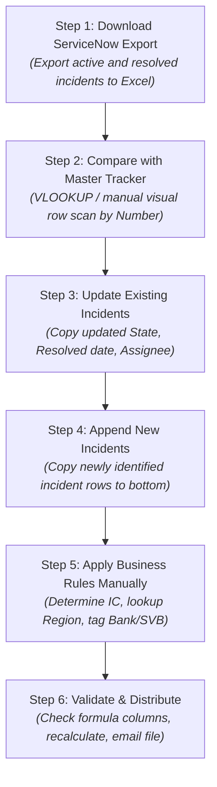
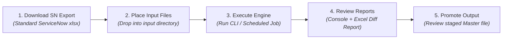
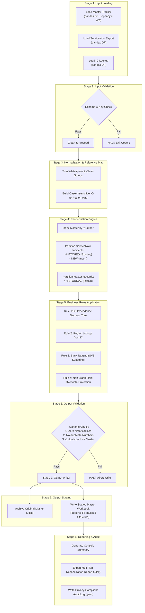
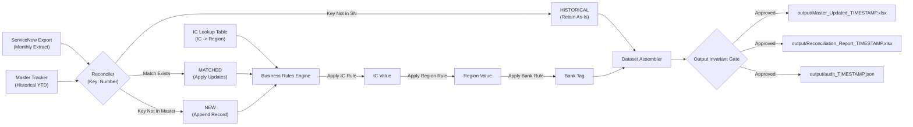
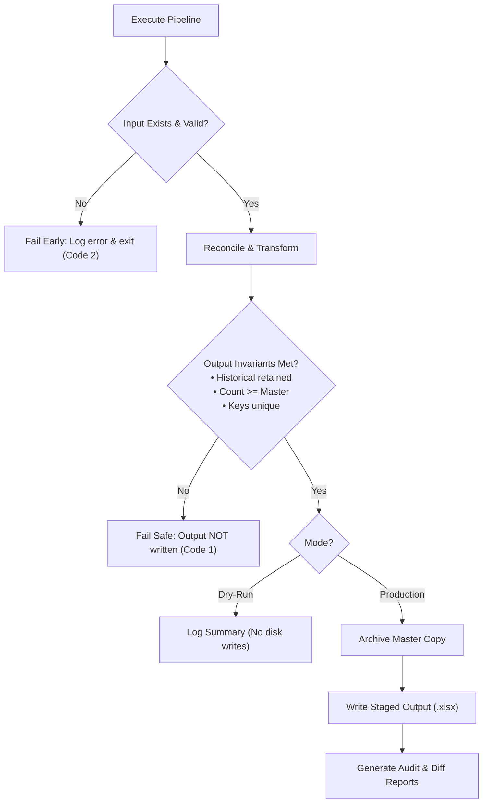

# FCB Monthly Incident Tracker Automation — System Architecture

## 1. Executive Summary & Context

The **FCB Monthly Incident Tracker Automation** system is an enterprise automation engine designed to reconcile monthly ServiceNow incident exports with the cumulative Year-To-Date (YTD) FCB Master Incident Tracker workbook. 

Historically, this reconciliation process was performed manually, requiring operational staff to visually inspect, compare, and merge datasets across multiple workbooks. Manual execution introduced significant operational overhead (4–6 hours per monthly cycle), risk of human error (inadvertent row overwrites, broken Excel formulas, inconsistent naming), and an absence of verifiable audit trails.

The automated system replaces this manual process with a high-throughput, deterministic Python engine utilizing `pandas` for vectorised data reconciliation and `openpyxl` for low-level workbook manipulation. The system operates on a zero-cloud, local execution model with strict data integrity guarantees, preserving historical incident records and workbook formulas while providing detailed reconciliation reporting.

---

## 2. Workflow Comparison

### 2.1 Current Manual Workflow

The legacy monthly reconciliation procedure consists of six distinct, manually executed steps:



#### Manual Workflow Deficiencies
1. **Formula Degradation:** Copy-pasting data into tables frequently corrupts adjacent formula columns (such as Resolution Time metrics).
2. **Accidental Data Loss:** Sorting or filtering errors during manual merges risk truncating historical records not present in the current month's ServiceNow extract.
3. **Inconsistent Rule Execution:** Human interpretation of the Incident Commander (IC) precedence rules and Bank tagging leads to inconsistent categorizations across reporting periods.
4. **No Auditability:** No systematic record exists detailing which fields were updated, which values changed, or why discrepancies occurred.

---

### 2.2 Target Automated Workflow

The automated architecture streamlines operations into a structured five-step lifecycle with full isolation between production files and working memory:



1. **Download ServiceNow Export:** Analyst extracts standard monthly incident data from ServiceNow.
2. **Place Input Files:** Analyst places the export and updated reference tables into designated relative paths or configures `config/config.json`.
3. **Execute Engine:** Run the pipeline via command line:
   ```bash
   python -m src.main --production
   ```
   *(Or run `--dry-run` to simulate changes without writing to disk).*
4. **Review Reconciliation Report:** Automated report highlights record counts, field-level diffs, new incidents, historical retentions, and IC lookup misses.
5. **Promote Staged Master Output:** Analyst inspects the timestamped output file in `output/` and replaces the production master file with verified changes.

---

## 3. Technology Evaluation & Selection

Multiple technical approaches were evaluated against enterprise criteria: formula preservation, testability, non-destructive write capabilities, corporate security compliance, and audit trail fidelity.

### 3.1 Technology Comparison Matrix

| Technology | Formula Preservation | Testability / CI | Safe Staging / Rollback | Auditability | Verdict |
| :--- | :--- | :--- | :--- | :--- | :--- |
| **Excel Formulas (XLOOKUP / IF)** | Poor (destroys dynamic ranges) | None | None (live file edits) | None | **Rejected** |
| **VBA / Excel Macros** | Fair (can corrupt on crash) | Very Low (opaque `.xlsm`) | Poor (direct file overwrite) | Manual logging | **Rejected** |
| **Power Query (M Engine)** | **Fails** (overwrites formulas with static values) | Low | Moderate | Low | **Rejected** |
| **Office Scripts (TypeScript)** | Moderate (cloud dependency) | Medium | Moderate | Low | **Rejected** |
| **Power Automate Desktop** | Dependent on underlying scripts | Low | Moderate | Low | **Wrapper Candidate** |
| **Python (`openpyxl` + `pandas`)** | **High** (`data_only=False` preserves AST) | **High** (`pytest` unit/integration) | **High** (timestamped staging) | **High** (JSON + Excel diffs) | **Selected** |

### 3.2 Evaluation Rationale

1. **Why Power Query Was Rejected:**
   Power Query is designed to ingest and reshape external datasets into new tabular structures. When loading data into an existing Excel table, Power Query overwrites or decouples pre-existing calculated formula columns (e.g., custom duration metrics, KPI formulas). Power Query cannot perform an in-place delta reconciliation that updates specific columns while preserving existing formula expressions on adjacent columns.

2. **Why VBA Was Rejected:**
   VBA macros reside inside binary Excel containers (`.xlsm`), making code review, branch tracking, and Git-based version control difficult. VBA testing is cumbersome and cannot be easily integrated into automated CI/CD pipelines. Furthermore, VBA script failures during execution can leave workbooks corrupted in memory.

3. **Why Python Was Selected:**
   - **Formula Preservation:** `openpyxl` reads workbooks with `data_only=False`, exposing the raw XML formula strings (e.g., `=[@Resolved]-[@Created]`). Formulas are dynamically re-applied to all reconciled rows.
   - **Deterministic Processing:** `pandas` provides fast indexing and row-level reconciliation, guaranteeing consistent output across thousands of incident records.
   - **Automated Testing:** Business rules, schemas, and reconciliation edge cases are verified using `pytest`.
   - **Operational Safety:** Supports `--dry-run` simulation, automatic backup archiving of the original Master Tracker, and validation gating that terminates execution before writing if invariants are violated.

---

## 4. Pipeline Architecture

The reconciliation engine executes as an eight-stage sequential pipeline with strict validation gates between phases.



### 4.1 Stage Breakdown

| Stage | Name | Responsible Component | Description |
| :--- | :--- | :--- | :--- |
| **1** | **Input Ingestion** | `data_loader.py` | Ingests Master Tracker, ServiceNow extract, and IC Lookup from paths configured in `config/config.json`. |
| **2** | **Input Validation** | `validator.py` | Validates required column headers, duplicate incident numbers, and malformed reference data. Halts pipeline if keys are missing. |
| **3** | **Normalization** | `normalizer.py`, `business_rules.py` | Strips extraneous whitespace, normalizes priority codes (`3 - Moderate` $\to$ class `3`), builds case-insensitive lookup indices. |
| **4** | **Reconciliation** | `reconciler.py` | Matches records on `Number`. Categorizes records into **Matched** (updates), **New** (appends), and **Historical** (retained master records). |
| **5** | **Business Rules** | `business_rules.py` | Applies IC determination logic, Region lookup, Bank derivation, and applies non-blank overwrite field mappings. |
| **6** | **Output Validation** | `validator.py` | Enforces mathematical and business invariants: output count must be $\ge$ input count, zero historical master records lost, zero duplicate IDs. |
| **7** | **Output Generation** | `output_writer.py` | In production mode, creates an archive copy of the master, duplicates workbook structure, clears data rows, and re-inserts reconciled data and formulas. |
| **8** | **Reporting & Audit**| `report_generator.py`, `audit.py` | Emits console metrics, exports a multi-tab Excel delta report, and writes an audit log to `output/audit_*.json`. |

---

## 5. End-to-End Data Flow

The system processes three input sources and routes records through deterministic transformation logic:



---

## 6. System Components

The codebase is organized into single-responsibility modules:

```
src/
├── config_loader.py     # JSON configuration loading, validation, and path resolution
├── data_loader.py       # Excel ingestion via pandas and openpyxl
├── validator.py         # Schema, primary key, and output invariant validation
├── normalizer.py        # String trimming, casing normalization, priority extraction
├── reconciler.py        # Core 3-way reconciliation logic
├── business_rules.py    # IC hierarchy, Region lookup, Bank assignment, field mapping
├── output_writer.py     # Template copying, row injection, formula preservation
├── report_generator.py  # Console summaries and multi-tab Excel diff reports
├── audit.py             # Execution metadata logger (incident numbers only)
└── main.py              # CLI entry point and pipeline orchestrator
```

### Component Responsibilities

1. **`config_loader.py` (`Config`):**
   Loads and validates `config/config.json`. Converts relative paths into absolute paths based on runtime directory context. Exposes strongly typed configurations.
2. **`data_loader.py`:**
   Reads Excel files into pandas DataFrames. Loads openpyxl workbooks with `data_only=False` to ensure workbook formulas and styling structures are maintained.
3. **`validator.py` (`ValidationResult`):**
   Accumulates non-blocking warnings and blocking errors. Checks for required columns, duplicate primary keys, null keys, and verifies that no master records were dropped during processing.
4. **`normalizer.py`:**
   Utility module handling whitespace stripping, case normalization for dictionary lookups, and regex-based extraction of priority integer classes.
5. **`reconciler.py` (`ReconciliationResult`):**
   Executes key-based reconciliation across ServiceNow and Master datasets. Tracks field-level updates and identifies IC lookup misses.
6. **`business_rules.py`:**
   Contains all business logic:
   - 3-tier IC determination decision tree.
   - Region resolution against normalized IC dictionary.
   - Bank assignment based on `'SVB'` substring presence in `Assignment group`.
   - Non-blank overwrite protection engine.
7. **`output_writer.py`:**
   Copies the base master workbook to an output location, clears existing data rows in the target worksheet, writes reconciled records, and restores formula patterns. Creates a timestamped archive of the pre-run master file.
8. **`report_generator.py`:**
   Builds the human-readable console execution report and generates `Reconciliation_Report_YYYYMMDD_HHMMSS.xlsx` containing Summary, Changes, New Incidents, and IC Lookup Misses tabs.
9. **`audit.py`:**
   Generates a structured JSON log documenting run timestamp, source files, record counts, execution status, and warning/error summaries.

---

## 7. Security & Compliance Architecture

The automation adheres strictly to corporate data protection and banking compliance requirements:

- **Local Processing Only:** All data manipulation occurs in local execution memory. No network calls, telemetry, or external cloud APIs are invoked.
- **Zero Hardcoded Secrets:** The application requires no credentials or service tokens. Source files are read directly from configured local/network paths.
- **Data Privacy in Audit Logging:** Audit logs record operational metadata and incident IDs (`Number`) only. Incident descriptions, root cause notes, and employee names are excluded from logs.
- **Git Version Control Safeguards:** `.gitignore` explicitly excludes `output/`, `archive/`, test artifacts, and any local files containing corporate configuration (`corporate_config.json`).
- **Deterministic Logic:** No probabilistic AI or Large Language Model (LLM) components are utilized in data transformation. All logic is 100% deterministic and auditable.

---

## 8. Error Handling & Resilience Strategy

The system is designed with a "safe failure" architecture to ensure production master files cannot be corrupted:



1. **Non-Destructive Staging:** The production Master Tracker file is **never** modified directly in place. Output is written to a timestamped file in the configured `output/` directory (e.g., `Master_Updated_20260912_143000.xlsx`).
2. **Pre-Run Archiving:** Before writing any output, the engine creates an exact snapshot of the master file in the `archive/` directory.
3. **Fail-Closed Validation Gates:** If input validation fails (Stage 2) or output invariants fail (Stage 6), the pipeline immediately terminates. Output writing is blocked.
4. **Dry-Run Capability:** Running with `--dry-run` performs data ingestion, reconciliation, business rule evaluation, and report compilation without generating any file writes.

---

## 9. Deployment & Operations

### 9.1 Prerequisites
- Python 3.9 or higher.
- Standard dependencies specified in `requirements.txt`:
  ```txt
  openpyxl>=3.1.0
  pandas>=2.0.0
  pytest>=7.0.0
  jsonschema>=4.0.0
  ```

### 9.2 Installation
```bash
# Clone repository and create virtual environment
git clone <repo-url>
cd FCB_Incident_Tracker_Automation
python -m venv .venv

# Activate virtual environment (Windows PowerShell)
.venv\Scripts\Activate.ps1

# Install requirements
pip install -r requirements.txt
```

### 9.3 Execution Modes
```bash
# 1. Dry Run (Rehearsal mode - default in development)
python -m src.main --dry-run

# 2. Production Run (Generates staged output and archive)
python -m src.main --production

# 3. Custom Configuration
python -m src.main --config path/to/custom_config.json --production
```

### 9.4 PyInstaller Standalone Packaging
For deployment to corporate end-user machines lacking a Python runtime, the application can be compiled into a standalone Windows executable:
```bash
pyinstaller --onefile --name FCB_Tracker_Automation src/main.py
```

---

## 10. Future Extensibility & Roadmap

1. **Power Automate Desktop (PAD) Orchestration:**
   A Power Automate Desktop wrapper flow can be deployed to automatically trigger the Python script whenever a new ServiceNow export is detected in a local drop folder.
2. **Enterprise SharePoint Synchronization:**
   Integrate automated retrieval and checkout of the Master Tracker from corporate SharePoint document libraries using Microsoft Graph API or mapped OneDrive sync clients.
3. **Scheduled Batch Execution:**
   Automate monthly execution via Windows Task Scheduler or enterprise job schedulers (e.g., Autosys, Control-M) following ServiceNow month-end export generation.
