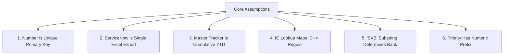
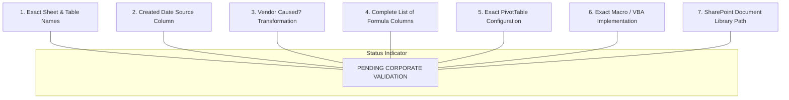

# FCB Monthly Incident Tracker Automation — Assumptions & Corporate Validation Log

## 1. Document Overview & Objective

This document catalogs the baseline technical assumptions upon which the **FCB Monthly Incident Tracker Automation** system is architected, alongside a formal register of items requiring corporate validation.

Assumptions are divided into:
1. **Core System Assumptions:** Technical and operational premises validated during system design.
2. **Corporate Validation Log:** Specific schema definitions, transformation rules, and infrastructure parameters that must be confirmed by corporate stakeholders prior to full production deployment.

---

## 2. Core System Assumptions



### 2.1 Unique Incident Identifier (`Number`)
- **Assumption:** Every incident record possesses a unique identifier column named `Number` (e.g., `INC0012345`).
- **Characteristics:** The `Number` is globally unique, immutable, and persistent across monthly reporting periods.
- **Pipeline Role:** Serves as the primary matching key for reconciling ServiceNow export rows against Master Tracker rows. Blanks or duplicates in this column are treated as fatal data corruption errors and halt execution.

### 2.2 ServiceNow Export File Structure
- **Assumption:** The ServiceNow monthly export is delivered as a single Microsoft Excel workbook (`.xlsx`).
- **Sheet Configuration:** Data resides on a single primary worksheet (default: `"Sheet1"`, configurable via `config/config.json`).
- **Data Layout:** Row 1 contains column header labels. Data rows commence at Row 2 with no leading title blocks or decorative headers.

### 2.3 Master Tracker Cumulative YTD Structure
- **Assumption:** The Master Tracker is a cumulative Year-To-Date (YTD) workbook retaining incidents from prior reporting months.
- **Sheet Configuration:** Data resides in a designated worksheet (default: `"FCB"`, configurable).
- **Retention Rule:** Any incident in the Master Tracker that is absent from the current ServiceNow monthly extract represents historical activity from an earlier period and must be preserved without modification.

### 2.4 Incident Commander (IC) Reference Table
- **Assumption:** A reference table or sheet exists mapping each Incident Commander (`IC`) to their respective operational territory (`Region`).
- **Matching:** IC names in the reference table match ServiceNow IC entries case-insensitively after leading and trailing whitespace is removed.

### 2.5 Bank / SVB Classification Logic
- **Assumption:** Operational tickets affiliated with Silicon Valley Bank can be definitively identified by the presence of the substring `"SVB"` (case-insensitive) within the ServiceNow `Assignment group` field.
- **Default:** All other assignment groups correspond to general First Citizens Bank operations and leave the `Bank` field blank.

### 2.6 Priority Format and Numeric Prefix
- **Assumption:** ServiceNow exports priority classifications containing an integer indicator, typically prefixed to a descriptive label (e.g., `"1 - Critical"`, `"2 - High"`, `"3 - Moderate"`, `"4 - Low"`).
- **Rule Interaction:** The priority parser extracts the leading digit to determine whether Class 3 logic applies for Incident Commander fallback resolution.

---

## 3. Corporate Validation Log

The following architectural and operational parameters require formal corporate stakeholder validation. Each item is tracked with current interim handling and the required sign-off action.



### 3.1 Validation Register

| # | Item Requiring Validation | Current Assumption / Default | Impact if Incorrect | Required Action / Sign-off |
| :--- | :--- | :--- | :--- | :--- |
| **VAL-01** | **Exact Sheet / Table Names** | Sheet: `"FCB"`, SN: `"Sheet1"`, Lookup: `"IC Lookup"`. Tables: `None` | `DataLoadError` on startup; file cannot be parsed | Operations team to confirm exact worksheet and Excel Table (`ListObject`) names. |
| **VAL-02** | **Created Date Source Column** | Currently unmapped (`null`). Existing values preserved. | Ticket creation dates not populated for new incidents | Clarify whether ServiceNow source column is `"Opened"`, `"Created"`, or `"sys_created_on"`. |
| **VAL-03** | **Vendor Caused? Transformation** | Currently unmapped (`null`). Existing values preserved. | Vendor accountability flags left blank on new tickets | Define source field and conversion rule (e.g., boolean vs vendor name vs text `"Yes"`/`"No"`). |
| **VAL-04** | **Complete List of Formula Columns** | Auto-detected from Row 2; known: `["Resolution Time"]` | Formula corruption if formulas are stored as static values | Provide exhaustive list of calculated columns in the Master Tracker. |
| **VAL-05** | **Exact PivotTable Configuration** | Preserved via workbook-level copy | Staged output may require manual "Refresh Data" upon opening | Confirm whether PivotTables require programmatic cache refresh or manual user refresh. |
| **VAL-06** | **Exact Macro / VBA Implementation** | Defaulting to standard `.xlsx`; openpyxl `keep_vba` available | VBA macros stripped if Master Tracker is actually `.xlsm` | Confirm whether production Master Tracker contains embedded VBA macros (`.xlsm`). |
| **VAL-07** | **SharePoint Document Library Path** | Configurable relative paths in `config/config.json` | Requires manual file copying between SharePoint and drop folder | IT/SharePoint admins to confirm production UNC or WebDAV synchronization path. |

---

## 4. In-Depth Analysis of Unvalidated Items

### 4.1 VAL-01: Exact Sheet and Table Names
- **Context:** Excel workbooks can store data in standard worksheets or inside structured Excel Tables (`ListObject`). If the production master workbook uses structured tables, column lookups can leverage table names.
- **Current Default in `config.json`:**
  ```json
  "sheets": {
      "master_sheet": "FCB",
      "servicenow_sheet": "Sheet1",
      "ic_lookup_sheet": "IC Lookup"
  },
  "tables": {
      "master_table": null,
      "servicenow_table": null,
      "ic_lookup_table": null
  }
  ```
- **Action Required:** Validate whether production workbooks use explicit table definitions and verify sheet tab names.

### 4.2 VAL-02: `Created` Date Source Column
- **Context:** ServiceNow maintains multiple creation timestamps depending on the table and view configuration:
  - `Opened`: The timestamp when the incident was logged by the caller/service desk.
  - `Created` (`sys_created_on`): The system database insertion timestamp.
  - `Incident Start`: The time the operational impairment actually began.
- **Action Required:** Corporate IT operations must confirm which timestamp represents the authoritative `Created` date in the Master Tracker.

### 4.3 VAL-03: `Vendor Caused?` Transformation Rule
- **Context:** In the Master Tracker, `Vendor Caused?` is often used for supplier governance and SLA chargebacks. In ServiceNow, vendor attribution may take several forms:
  - A boolean flag (`u_vendor_caused` = `true`/`false`).
  - A reference link to a `core_company` record (`Vendor` = `"Vendor Name"`).
  - A third-party ticket number field (`Vendor Ticket`).
- **Action Required:** Confirm the source field in the ServiceNow export and provide the required target values (e.g., if vendor is present, set `"Yes"`, else `"No"`).

### 4.4 VAL-04: Complete List of Formula Columns
- **Context:** While the engine automatically inspects the template row of the Master Tracker to detect formula expressions starting with `"=":
  ```python
  cell.value.startswith("=")
  ```
  workbooks occasionally contain rows where formulas were accidentally converted into static values by manual copy-pasting.
- **Action Required:** Audit the production Master Tracker and supply the complete, authoritative list of formula columns and their canonical formula expressions (e.g., `Resolution Time` $\to$ `=[@Resolved]-[@Created]`).

### 4.5 VAL-05: PivotTable Refresh Behavior
- **Context:** Openpyxl copies workbook structures—including PivotTable definitions—without corrupting XML definitions. However, openpyxl does not run the Excel calculation engine to recalculate pivot caches.
- **Action Required:** Confirm whether analysts expect to click "Refresh All" when opening the finalized master workbook in desktop Excel, or if an automated Excel application wrapper (via `win32com` / PowerShell) is required.

### 4.6 VAL-06: Macro-Enabled Workbooks (`.xlsm`)
- **Context:** If the Master Tracker workbook contains VBA macros, saving via openpyxl requires setting `keep_vba=True` and maintaining the `.xlsm` file extension. Saving an `.xlsm` file as `.xlsx` permanently strips all embedded VBA modules.
- **Action Required:** Confirm the exact file extension of the production Master Tracker (`.xlsx` vs `.xlsm`).

### 4.7 VAL-07: SharePoint Document Library Path
- **Context:** In enterprise environments, the Master Tracker is frequently hosted on a corporate SharePoint Online document library or Microsoft Teams channel.
- **Action Required:** Determine the preferred operational file hand-off mechanism:
  - **Option A (Manual Staging):** Analyst downloads Master Tracker to local folder, runs tool, and uploads staged output back to SharePoint.
  - **Option B (OneDrive Sync):** Point `config/config.json` directly to local synced OneDrive/SharePoint directory paths.
  - **Option C (API Integration):** Future enhancement to interface directly via Microsoft Graph REST API.

---

## 5. Risk Mitigation & Fallback Strategy

To guarantee operational continuity while validation items are being confirmed, the automation engine applies the following safety fallbacks:

1. **Non-Destructive Defaults:** Any column whose mapping is unresolved (`Created`, `Vendor Caused?`) will **never** overwrite existing data in the Master Tracker.
2. **Configuration Decoupling:** All sheet names, column mappings, and keyword triggers are isolated in `config/config.json`. Adjusting parameters requires editing JSON configuration without touching Python source code.
3. **Comprehensive Diagnostic Warnings:** Any missing lookup value or unmapped column emits an operational warning in the console summary and the Excel reconciliation report, ensuring complete visibility during testing and parallel runs.
