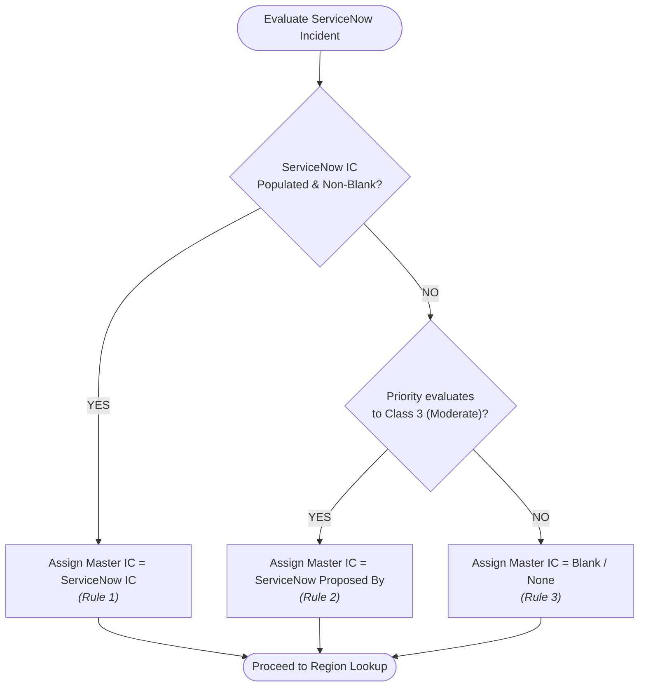

# FCB Monthly Incident Tracker Automation — Business Rules Specification

## 1. Document Overview

This document specifies the business rules governing the reconciliation of monthly ServiceNow incident data into the FCB Master Incident Tracker. All business rules are implemented deterministically within `src/business_rules.py` and `src/normalizer.py`, and are fully configurable via `config/config.json`.

---

## 2. Rule 1: Incident Commander (IC) Determination

### 2.1 Context and Purpose
The Incident Commander (IC) field identifies the lead coordinator assigned to an incident. Because ServiceNow stores IC information differently depending on incident severity and logging habits, a 3-tier precedence rule is applied to determine the final IC value for each incident.

### 2.2 Precedence Rules
1. **Rule 1 (IC Populated):** If the ServiceNow `IC` field contains a non-blank string value, use that value directly as the Master Tracker `IC`.
2. **Rule 2 (IC Blank + Priority 3 Fallback):** If the ServiceNow `IC` field is blank AND the incident's `Priority` evaluates to Class 3 (Moderate), use the ServiceNow `Proposed By` field as the Master Tracker `IC`. *(Note: If `Proposed By` is also blank, IC will be blank).*
3. **Rule 3 (IC Blank + Priority != 3):** If the ServiceNow `IC` field is blank AND the incident's `Priority` is NOT Class 3 (e.g., Priority 1, 2, 4, 5, or unassigned), the Master Tracker `IC` remains blank.

### 2.3 Decision Tree Diagram



### 2.4 Priority Normalization in IC Rule
ServiceNow typically exports priority descriptions with numeric prefixes (e.g., `"3 - Moderate"`, `"3"`, or `3`). The rule normalizer extracts the numeric class before evaluation:
- Inputs evaluating to Class 3: `"3 - Moderate"`, `"3"`, `3`, `" 3 - Moderate "`.
- Inputs not evaluating to Class 3: `"1 - Critical"`, `"2 - High"`, `"4 - Low"`, `"5 - Planning"`, `""`, `None`.

### 2.5 IC Determination Truth Table

| Scenario | ServiceNow `IC` | ServiceNow `Priority` | ServiceNow `Proposed By` | Final Master `IC` | Applied Rule |
| :--- | :--- | :--- | :--- | :--- | :--- |
| **1** | `"Jane Doe"` | `"1 - Critical"` | `"John Smith"` | `"Jane Doe"` | Rule 1 |
| **2** | `"Jane Doe"` | `"3 - Moderate"` | `"John Smith"` | `"Jane Doe"` | Rule 1 |
| **3** | `""` (Blank) | `"3 - Moderate"` | `"John Smith"` | `"John Smith"` | Rule 2 |
| **4** | `""` (Blank) | `"3 - Moderate"` | `""` (Blank) | `""` (Blank) | Rule 2 (Proposed By blank) |
| **5** | `""` (Blank) | `"1 - Critical"` | `"John Smith"` | `""` (Blank) | Rule 3 |
| **6** | `""` (Blank) | `"2 - High"` | `"John Smith"` | `""` (Blank) | Rule 3 |
| **7** | `""` (Blank) | `"4 - Low"` | `"John Smith"` | `""` (Blank) | Rule 3 |
| **8** | `None` | `None` | `"John Smith"` | `""` (Blank) | Rule 3 |

---

## 3. Rule 2: Region Lookup Rule

### 3.1 Context and Purpose
Each Incident Commander is affiliated with a geographic or operational region (e.g., East, West, Central, EMEA, APAC). The `Region` column in the Master Tracker is derived from the determined `IC` value using an external reference table (`IC Lookup`).

### 3.2 Lookup Mechanics
1. **Source Table:** An Excel sheet or structured table defined in `config/config.json` containing pairs of `IC` and `Region`.
2. **Case-Insensitive Matching:** IC names are trimmed of surrounding whitespace and matched case-insensitively against the lookup map.
   - Example: `"jane doe"` in the incident matches `"Jane Doe"` in the lookup dictionary.
3. **Lookup Resolution:**
   - **Match Found:** Set `Region` to the corresponding mapped region value (e.g., `"East"`).
   - **Match Not Found (Unmatched IC):** Set `Region` to blank (`""`), and log an explicit warning:
     ```
     [WARNING] INC0012345: IC='Jane Doe' not found in IC lookup table. Region set to blank.
     ```
   - **Blank IC:** If the determined `IC` is blank, `Region` is automatically set to blank (`""`) without generating an error or warning.

### 3.3 Reference Table Validation
During pipeline Stage 2, the `IC Lookup` reference table is validated against the following criteria:
- The required columns (`IC`, `Region`) must exist.
- No blank IC keys are permitted in the lookup table.
- Duplicate IC keys in the reference table produce a blocking error or warning depending on configuration.

---

## 4. Rule 3: Bank / SVB Determination Rule

### 4.1 Context and Purpose
Following organizational integrations, incidents related to Silicon Valley Bank (SVB) operations must be categorized with `Bank = "SVB"`. All other incidents remain unassigned/blank for general FCB operations.

### 4.2 Derivation Logic
The `Bank` field is derived by checking whether the incident's `Assignment group` contains the substring `"SVB"`:

$$\text{Bank} = \begin{cases} \text{"SVB"} & \text{if } \text{"SVB"} \subseteq \text{Assignment group (case-insensitive)} \\ \text{"" (blank)} & \text{otherwise} \end{cases}$$

### 4.3 Execution Examples

| Incident `Assignment group` | Substring Match (`"SVB"`) | Assigned `Bank` |
| :--- | :--- | :--- |
| `"SVB-Core-Banking"` | **True** | `"SVB"` |
| `"svb-wire-operations"` | **True** (case-insensitive) | `"SVB"` |
| `"IT-SVB-Helpdesk"` | **True** | `"SVB"` |
| `"Commercial Lending Support"` | **False** | `""` (Blank) |
| `"Retail Branch Operations"` | **False** | `""` (Blank) |
| `""` (Blank / None) | **False** | `""` (Blank) |

---

## 5. Rule 4: Priority Normalization

### 5.1 Context and Purpose
ServiceNow stores priority as a composite string containing a numeric classification and a label (e.g., `"1 - Critical"`, `"2 - High"`, `"3 - Moderate"`, `"4 - Low"`). Different exports or integrations may supply integers (`3`), strings (`"3"`), or text.

### 5.2 Normalization Algorithm
The normalizer extracts the integer classification using the following precedence:
1. **Direct Integer Cast:** Attempt `int(value)` if already numeric.
2. **Delimiter Split:** Split on configurable delimiter (default: `" - "`), extracting the leading token and casting to integer.
3. **Regex Extraction:** Fallback regex `^(\d+)` to match the first contiguous sequence of digits.
4. **Unparseable Fallback:** If no digits are found, return `None`.

### 5.3 Configuration Reference
```json
"priority_normalization": {
    "extract_numeric": true,
    "separator": " - ",
    "patterns": [
        {"input": "1 - Critical", "class": 1},
        {"input": "2 - High", "class": 2},
        {"input": "3 - Moderate", "class": 3},
        {"input": "4 - Low", "class": 4}
    ]
}
```

---

## 6. Rule 5: Non-Blank Overwrite Protection

### 6.1 Context and Purpose
Monthly ServiceNow extracts frequently contain incomplete data for specific fields (e.g., unpopulated assignees, blank resolution dates for closed tickets, or transient null values). In the Master Tracker, operational analysts often manually enrich or maintain historical records.

> [!IMPORTANT]
> **Core Principle:** An existing value in the Master Tracker must NEVER be overwritten with a blank or null value merely because ServiceNow provided a blank.

### 6.2 Protection Mechanics
For every mapped field where `overwrite_if_blank = False`:
- **Source Non-Blank:** If ServiceNow has a valid, non-blank value that differs from Master Tracker, update Master Tracker and record the change in the audit diff.
- **Source Blank:** If ServiceNow has a blank (`""`, `None`, or `NaN`) and Master Tracker already has a value, **preserve the existing Master Tracker value**.
- **Both Blank:** Field remains blank.

### 6.3 Behavior Matrix

| Existing Master Value | ServiceNow Source Value | `overwrite_if_blank` | Resulting Master Value | Change Logged? |
| :--- | :--- | :--- | :--- | :--- |
| `"John Doe"` | `"Jane Smith"` | `False` | `"Jane Smith"` | **Yes** (Updated) |
| `"John Doe"` | `""` (Blank / None) | `False` | `"John Doe"` | **No** (Protected) |
| `""` (Blank) | `"Jane Smith"` | `False` | `"Jane Smith"` | **Yes** (Populated) |
| `"John Doe"` | `""` (Blank / None) | `True` | `""` (Blank) | **Yes** (Overwritten) |

---

## 7. Rule 6: Historical Record Retention

### 7.1 Context and Purpose
The FCB Master Incident Tracker is a cumulative Year-To-Date (YTD) repository. A monthly ServiceNow extract, by contrast, often represents a rolling 30-day or 60-day window of active or recently resolved tickets.

### 7.2 Invariant Guarantee
- **Rule:** Incidents existing in the Master Tracker that do not appear in the current ServiceNow extract **MUST NEVER BE DELETED OR DROPPED**.
- **Classification:** Unmatched master records are classified as `HISTORICAL` records and are preserved intact in the final output workbook.
- **Validation Check:** Pipeline Stage 6 executes an invariant assertion:
  $$\text{Master Historical Keys} \subseteq \text{Output Keys}$$
  If even a single historical master incident is missing from the output set, the pipeline **aborts immediately**, raises an invariant error, and refuses to write output.

---

## 8. Unresolved Rules Requiring Corporate Validation

The following business rules cannot be finalized without formal sign-off from corporate business stakeholders:

### 8.1 Unresolved Rule A: Vendor Caused?
- **Current State:** The Master Tracker contains a column titled `Vendor Caused?`. In ServiceNow, vendor responsibility may be indicated by a boolean checkbox (`u_vendor_caused`), a text dropdown, a Vendor Ticket Number, or a non-empty `Vendor` reference field.
- **Status:** Marked as `TBD` in configuration.
- **Interim Pipeline Behavior:** The automation preserves any existing values in `Vendor Caused?` in the Master Tracker. New records leave this field blank.
- **Corporate Validation Required:**
  1. Confirm exact ServiceNow source field name.
  2. Confirm transformation logic (e.g., If ServiceNow `Vendor` $\neq$ blank $\implies$ `"Yes"`, else `"No"`).

### 8.2 Unresolved Rule B: Created Date Source Column
- **Current State:** The Master Tracker contains a `Created` column. ServiceNow extracts often include multiple candidate timestamp fields: `Opened`, `Created`, `sys_created_on`, or `Incident Start`.
- **Status:** Marked as `TBD` in configuration.
- **Interim Pipeline Behavior:** Preserves existing Master Tracker values. New records leave `Created` blank unless manually mapped.
- **Corporate Validation Required:**
  1. Confirm the definitive ServiceNow source column for ticket creation.
  2. Confirm expected date/timestamp formatting in the Excel master (e.g., `YYYY-MM-DD HH:MM:SS` vs `MM/DD/YYYY`).
