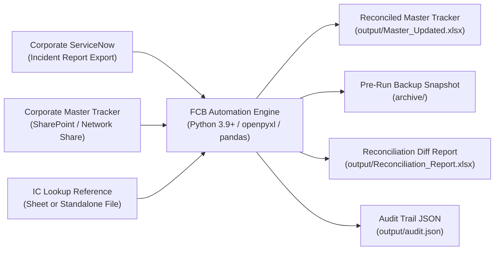

# FCB Monthly Incident Tracker — Enterprise Corporate Setup Guide

A complete technical configuration and deployment manual for deploying the **FCB Monthly Incident Tracker Automation** within the First Citizens Bank corporate IT environment.

---

## 📋 Table of Contents

- [1. Overview & Architecture Considerations](#1-overview--architecture-considerations)
- [2. Step-by-Step Corporate Configuration](#2-step-by-step-corporate-configuration)
  - [Step 1: Configure Master Tracker Path](#step-1-configure-master-tracker-path)
  - [Step 2: Configure ServiceNow Export Path](#step-2-configure-servicenow-export-path)
  - [Step 3: Configure IC Lookup Path](#step-3-configure-ic-lookup-path)
  - [Step 4: Configure Sheet & Table Names](#step-4-configure-sheet--table-names)
  - [Step 5: Configure Field Mappings](#step-5-configure-field-mappings)
  - [Step 6: Verify `Created` Field Source (⚠️ Validation Required)](#step-6-verify-created-field-source--validation-required)
  - [Step 7: Verify `Vendor Caused?` Transformation (⚠️ Validation Required)](#step-7-verify-vendor-caused-transformation--validation-required)
  - [Step 8: Execute Connectivity & Data Dry Run](#step-8-execute-connectivity--data-dry-run)
  - [Step 9: Review Dry Run Output](#step-9-review-dry-run-output)
  - [Step 10: Execute First Production Run](#step-10-execute-first-production-run)
  - [Step 11: Validate Output by Spot-Checking Incidents](#step-11-validate-output-by-spot-checking-incidents)
  - [Step 12: Archive & Disaster Recovery Verification](#step-12-archive--disaster-recovery-verification)
- [3. Enterprise SharePoint & OneDrive Integration](#3-enterprise-sharepoint--onedrive-integration)
- [4. Python Availability & Packaging Options](#4-python-availability--packaging-options)
  - [Option A: Enterprise Python 3.9+ Runtime](#option-a-enterprise-python-39-runtime)
  - [Option B: Standalone Executable via PyInstaller](#option-b-standalone-executable-via-pyinstaller)
- [5. Automated Scheduling Options](#5-automated-scheduling-options)
  - [Option 1: Windows Task Scheduler](#option-1-windows-task-scheduler)
  - [Option 2: Microsoft Power Automate Desktop](#option-2-microsoft-power-automate-desktop)
- [6. Corporate Validation Checklist](#6-corporate-validation-checklist)

---

## 1. Overview & Architecture Considerations

This deployment guide transitions the automation pipeline from development/synthetic testing into the live enterprise environment.



> [!IMPORTANT]
> All file paths in this guide and in [`config/config.json`](file:///c:/Users/Ansh%20Singh/OneDrive/Desktop/Automation/FCB_Incident_Tracker_Automation/config/config.json) are configurable. Never hard-code personal workstation paths (e.g., `C:\Users\<username>\...`) in repository-managed files. Use relative paths, environment variables, or UNC paths (`\\corporate.domain\shares\...`).

---

## 2. Step-by-Step Corporate Configuration

Open [`config/config.json`](file:///c:/Users/Ansh%20Singh/OneDrive/Desktop/Automation/FCB_Incident_Tracker_Automation/config/config.json) in an editor. Complete the 12 steps below.

### Step 1: Configure Master Tracker Path

Under the `"paths"` key, set `"master_tracker"` to the absolute or relative location of the live corporate Master Incident Tracker:

```json
{
  "paths": {
    "master_tracker": "//fcb-share.corp.domain/Incident_Management/FCB_Master_Incident_Tracker.xlsx"
  }
}
```

*If synchronized via OneDrive for Business or SharePoint, configure the local sync directory (see [Section 3](#3-enterprise-sharepoint--onedrive-integration)).*

---

### Step 2: Configure ServiceNow Export Path

Set `"servicenow_input"` to the designated landing folder or monthly file path:

```json
{
  "paths": {
    "servicenow_input": "data/incoming/ServiceNow_Incidents_Monthly.xlsx"
  }
}
```

---

### Step 3: Configure IC Lookup Path

The IC Lookup table maps Incident Coordinator (IC) names to operational Regions. Set `"ic_lookup"`:

```json
{
  "paths": {
    "ic_lookup": "//fcb-share.corp.domain/Incident_Management/FCB_Master_Incident_Tracker.xlsx"
  }
}
```

> [!NOTE]
> If the IC Lookup table is stored as an internal tab inside the Master Tracker workbook itself, point `"ic_lookup"` to the exact same file path as `"master_tracker"`. The system reads the specific tab configured in Step 4.

---

### Step 4: Configure Sheet & Table Names

Ensure worksheet names match your corporate Excel files:

```json
{
  "sheets": {
    "master_sheet": "FCB",
    "servicenow_sheet": "Sheet1",
    "ic_lookup_sheet": "IC Lookup"
  },
  "tables": {
    "master_table": null,
    "servicenow_table": null,
    "ic_lookup_table": null
  }
}
```

- If using regular Excel worksheets (standard data grids starting on row 1), leave `"tables"` set to `null`.
- If using Excel Structured Tables (ListObjects with named ranges), specify their table names (e.g., `"master_table": "tbl_FCB_Incidents"`).

---

### Step 5: Configure Field Mappings

The `"field_mapping"` block defines how ServiceNow export headers map to Master Tracker headers:

```json
{
  "field_mapping": {
    "Number": {
      "source_column": "Number",
      "target_column": "Number",
      "is_key": true,
      "overwrite_if_blank": false
    },
    "Short description": {
      "source_column": "Short Description",
      "target_column": "Short description",
      "overwrite_if_blank": false
    },
    "Primary CI/Application": {
      "source_column": "Configuration Item",
      "target_column": "Primary CI/Application",
      "overwrite_if_blank": false
    },
    "Priority": {
      "source_column": "Priority",
      "target_column": "Priority",
      "overwrite_if_blank": false
    },
    "State": {
      "source_column": "State",
      "target_column": "State",
      "overwrite_if_blank": false
    },
    "Resolved": {
      "source_column": "Actual Incident Resolve",
      "target_column": "Resolved",
      "overwrite_if_blank": false
    },
    "Assignee": {
      "source_column": "Assigned To",
      "target_column": "Assignee",
      "overwrite_if_blank": false
    },
    "Assignment group": {
      "source_column": "Assignment Group",
      "target_column": "Assignment group",
      "overwrite_if_blank": false
    },
    "Caused by Change": {
      "source_column": "Caused by Change",
      "target_column": "Caused by Change",
      "overwrite_if_blank": false
    }
  }
}
```

> [!TIP]
> Ensure `"overwrite_if_blank": false` is retained for all fields to prevent ServiceNow blank fields from wiping out enriched Master Tracker data.

---

### Step 6: Verify `Created` Field Source (⚠️ Validation Required)

> [!WARNING]
> ⚠️ **REQUIRES CORPORATE VALIDATION**: The exact ServiceNow source column for the Master Tracker's `Created` field is currently unconfirmed.
>
> 1. Consult your ServiceNow administrator or review export headers to identify the creation date field (e.g., `Opened`, `Created`, or `sys_created_on`).
> 2. Once validated, move the field definition from `"unmapped_fields"` to `"field_mapping"`:
>    ```json
>    "Created": {
>      "source_column": "Opened",
>      "target_column": "Created",
>      "overwrite_if_blank": false
>    }
>    ```
> 3. If left unmapped, existing `Created` values in the Master Tracker are strictly preserved, while newly added incidents will receive a blank `Created` date until manually entered.

---

### Step 7: Verify `Vendor Caused?` Transformation (⚠️ Validation Required)

> [!WARNING]
> ⚠️ **REQUIRES CORPORATE VALIDATION**: The transformation logic from ServiceNow `Vendor` fields to the Master Tracker `Vendor Caused?` (Yes/No or boolean) field requires business rule confirmation.
>
> 1. Determine whether `Vendor Caused?` should be derived from:
>    - Presence of a vendor name in a `Vendor` column.
>    - A dedicated flag in ServiceNow (e.g., `u_vendor_caused`).
>    - Resolution category/code containing "Vendor".
> 2. Once corporate sign-off is obtained, configure the mapping or transformation rule accordingly.
> 3. Currently, existing values in `Vendor Caused?` are preserved for historical records and left blank for new records.

---

### Step 8: Execute Connectivity & Data Dry Run

Verify network connectivity, permissions, and configuration integrity by running the pipeline in dry-run mode:

```bash
python -m src.main --dry-run
```

The pipeline will:
- Test reading the Master Tracker from the corporate share.
- Test reading the ServiceNow export.
- Validate required columns across all sheets.
- Verify that `Number` columns have no illegal duplicates or blank rows.
- Build the IC lookup map.
- Reconcile data in memory and validate output invariants.

---

### Step 9: Review Dry Run Output

Inspect the execution output:
1. Ensure exit code is `0` (`PIPELINE COMPLETE — STATUS: PASSED`).
2. Open `output/Reconciliation_Report_<TIMESTAMP>.xlsx`.
3. Review the `Changes` and `IC Lookup Misses` sheets.
4. If missing columns or IC lookup misses appear, address them in the source data or lookup sheet before continuing.

---

### Step 10: Execute First Production Run

Execute the production pipeline to write the synchronized dataset:

```bash
python -m src.main --production
```

Verify console output indicates:
```text
[7/8] Writing output...
  Archive created: FCB_Master_Incident_Tracker_before_YYYYMMDD_HHMMSS.xlsx
  Output written: Master_Updated_YYYYMMDD_HHMMSS.xlsx
```

---

### Step 11: Validate Output by Spot-Checking Incidents

Open the resulting `output/Master_Updated_<TIMESTAMP>.xlsx` and conduct a spot check:
1. **Existing Incidents**: Verify that 3–5 known incidents show updated states and assignees.
2. **New Incidents**: Verify that new incidents appear at the end with correct IC, Region, and SVB flags.
3. **Historical Incidents**: Confirm closed incidents from previous quarters remain untouched.
4. **Formula Columns**: Check formula columns (such as `Resolution Time`) to verify formula syntax `=[@Resolved]-[@Created]` is functioning.

---

### Step 12: Archive & Disaster Recovery Verification

Confirm that an archive backup was generated in the `archive/` folder:
- Path: `archive/FCB_Master_Incident_Tracker_before_<TIMESTAMP>.xlsx`

#### Disaster Recovery Protocol:
If a production issue occurs:
1. Close any open Excel sessions.
2. Restore the latest backup from `archive/` directly back to the active tracker location.
3. Review `output/audit_<TIMESTAMP>.json` for the failure error log.

---

## 3. Enterprise SharePoint & OneDrive Integration

Because First Citizens Bank utilizes Microsoft 365, Master Trackers are typically hosted in SharePoint Document Libraries or Microsoft Teams channels.

### Recommended Integration Patterns

#### Pattern 1: OneDrive for Business Local Sync (Recommended)
1. Open the SharePoint document library containing the Master Tracker.
2. Click **Sync** in the SharePoint toolbar to synchronize the library locally via the Microsoft OneDrive sync client.
3. Configure `config.json` with the local synced folder path (using environment variable expansion or user-independent relative structure):
   ```json
   {
     "paths": {
       "master_tracker": "C:/SharePoint_Sync/Incident_Management/FCB_Master_Incident_Tracker.xlsx"
     }
   }
   ```
4. **Advantage**: Handles offline caching, Microsoft authentication, and automatic background upload upon file save.

#### Pattern 2: Mapped Network Drive (Corporate File Share)
If using an on-premises or hybrid SMB share:
```json
{
  "paths": {
    "master_tracker": "Z:/Incident_Management/FCB_Master_Incident_Tracker.xlsx"
  }
}
```

> [!CAUTION]
> **Excel File Locking**: If another user has the Master Tracker open in Excel desktop with co-authoring disabled, the file will be locked for editing.
> - Ensure all analysts close the tracker before automated execution.
> - The automation writes new output files to `output/Master_Updated_<TIMESTAMP>.xlsx` to prevent writing directly into a locked file. Once generated, the updated workbook can replace the master.

---

## 4. Python Availability & Packaging Options

Depending on enterprise workstation restrictions, choose between standard Python runtime or a standalone executable.

### Option A: Enterprise Python 3.9+ Runtime

If Python is approved and installed via enterprise software distribution (e.g., Software Center, Microsoft Intune):

```bash
# Setup virtual environment
python -m venv .venv
.venv\Scripts\activate

# Install dependencies
pip install -r requirements.txt
```

### Option B: Standalone Executable via PyInstaller

For workstations where installing Python or compiling packages is restricted by IT security policy, package the pipeline into a single standalone `.exe` using PyInstaller:

```bash
# In an approved development environment with Python:
pip install pyinstaller

# Build standalone executable
pyinstaller --noconfirm --onedir --name "FCB_Tracker_Automation" \
  --add-data "config/config.json;config" \
  src/main.py
```

Distribute the generated `dist/FCB_Tracker_Automation` folder to the target operator machine. The operator can run:

```powershell
.\FCB_Tracker_Automation.exe --production
```

---

## 5. Automated Scheduling Options

### Option 1: Windows Task Scheduler

To execute the automation automatically following monthly ServiceNow export delivery:

1. Create a wrapper batch script: `run_monthly_tracker.bat`
   ```cmd
   @echo off
   cd /d "%~dp0"
   call .venv\Scripts\activate.bat
   python -m src.main --production >> output\task_scheduler.log 2>&1
   ```
2. Open **Windows Task Scheduler** (`taskschd.msc`).
3. Click **Create Basic Task**:
   - **Name**: `FCB_Monthly_Incident_Tracker_Update`
   - **Trigger**: Monthly (e.g., First business day of each month at 06:00 AM).
   - **Action**: Start a program.
   - **Program/script**: `C:\Enterprise_Automation\FCB_Incident_Tracker\run_monthly_tracker.bat`
   - **Start in**: `C:\Enterprise_Automation\FCB_Incident_Tracker\`
4. Configure task settings:
   - Check *"Run whether user is logged on or not"*.
   - Check *"Run with highest privileges"*.

---

### Option 2: Microsoft Power Automate Desktop

If ServiceNow reports are emailed or delivered via SharePoint:
1. Configure Power Automate to detect the new monthly report in Outlook or SharePoint.
2. Save the incoming report to `data/incoming/ServiceNow_Incidents_Monthly.xlsx`.
3. Add a **Run DOS Command** or **Run PowerShell Script** action:
   ```powershell
   & "C:\Enterprise_Automation\FCB_Incident_Tracker\.venv\Scripts\python.exe" -m src.main --production
   ```
4. Add an action to notify the incident management team with the generated `output/Reconciliation_Report_<TIMESTAMP>.xlsx` attached.

---

## 6. Corporate Validation Checklist

Before releasing the automation into general monthly production, obtain sign-off on each item:

| Validation Item | Status | Sign-off Owner | Notes / References |
| :--- | :---: | :--- | :--- |
| **Master Tracker Path & Permissions** | ⬜ Pending | IT / Storage Lead | Read/write access confirmed |
| **ServiceNow Export Column Headers** | ⬜ Pending | ServiceNow Admin | Export view contains all required 11 fields |
| **IC-to-Region Reference Table** | ⬜ Pending | Incident Ops Lead | Complete list of active IC names |
| **`Created` Field Source Definition** | ⚠️ REQUIRES VALIDATION | ServiceNow Lead | Identify exact date attribute |
| **`Vendor Caused?` Business Rule** | ⚠️ REQUIRES VALIDATION | Incident Ops Lead | Confirm derivation rule |
| **Formula Preservation Verification** | ⬜ Pending | Ops Analyst | `Resolution Time` formula verified |
| **SharePoint Sync / Lock Policy** | ⬜ Pending | Desktop Eng | Ensure no co-author lock conflicts |
| **Pre-run Archive Retention Policy** | ⬜ Pending | Compliance / Records | Retain 12 months of backups |
