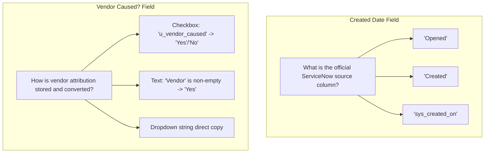

# FCB Monthly Incident Tracker Automation — Field Mapping Specification

## 1. Overview & Data Schema

This document defines the field-level data dictionary and transformation rules mapping ServiceNow monthly incident extracts to the FCB Master Incident Tracker workbook.

Mappings are executed dynamically based on the configuration defined in `config/config.json`. The pipeline adheres strictly to **non-blank overwrite protection** (`overwrite_if_blank = False`), ensuring existing master data is never degraded by transient null values in ServiceNow.

---

## 2. Master Field Mapping Matrix

The table below provides the authoritative source-to-target field mapping definition:

| Master Tracker Column | ServiceNow Source Column | Overwrite if Blank | Notes |
| :--- | :--- | :--- | :--- |
| **Number** | `Number` | **N/A (key)** | Unique incident primary key (e.g., `INC0012345`). Used for matching. Immutable. |
| **Short description** | `Short Description` | **No** | Incident summary. Whitespace-trimmed. |
| **Primary CI/Application** | `Configuration Item` | **No** | Impacted application, service, or server configuration item. |
| **Priority** | `Priority` | **No** | Severity classification. Normalized from string (e.g., `"3 - Moderate"` $\to$ `3`). |
| **State** | `State` | **No** | Current incident lifecycle status (e.g., `Resolved`, `Closed`, `In Progress`). |
| **Resolved** | `Actual Incident Resolve` | **No** | Timestamp when technical resolution was confirmed. Preserved if source is blank. |
| **Created** | *TBD* | **N/A** | Ticket creation timestamp. **Requires corporate validation**. |
| **IC** | *Business Rule* | **N/A** | Incident Commander. Evaluated via 3-tier precedence rule. |
| **Assignee** | `Assigned To` | **No** | Individual technical resource owning the ticket. |
| **Assignment group** | `Assignment Group` | **No** | Technical team or escalation tier managing the incident. |
| **Caused by Change** | `Caused by Change` | **No** | Reference to Change Request ID (CHG) if incident resulted from maintenance. |
| **Vendor Caused?** | *TBD* | **N/A** | Boolean or descriptive vendor attribution flag. **Requires corporate validation**. |
| **Region** | *IC Lookup* | **N/A** | Geographic territory derived from `IC` via external lookup table. |
| **Bank** | *Business Rule* | **N/A** | Corporate entity flag (`"SVB"` or blank) derived from `Assignment Group`. |

---

## 3. Detailed Column Specifications

### 3.1 Primary Identification & Direct Mapped Columns

#### `Number` (Primary Key)
- **Target Data Type:** String
- **Source Field:** `Number`
- **Validation Constraints:** Must not be null or whitespace-only. Must be globally unique across both datasets.
- **Handling:** Used by the reconciler to index records. The key itself is never modified or overwritten.

#### `Short description`
- **Target Data Type:** String
- **Source Field:** `Short Description`
- **Transformation:** Leading and trailing whitespace is stripped.
- **Overwrite Rule:** Only updates if ServiceNow contains a non-empty string.

#### `Primary CI/Application`
- **Target Data Type:** String
- **Source Field:** `Configuration Item`
- **Transformation:** Whitespace trimmed.
- **Overwrite Rule:** Preserves existing master CI if ServiceNow export field is blank.

#### `Priority`
- **Target Data Type:** String / Integer
- **Source Field:** `Priority`
- **Transformation:** Parsed by `extract_priority_class()`. For example, `"3 - Moderate"` evaluates to class `3`.
- **Overwrite Rule:** Updates if ServiceNow provides an updated priority level.

#### `State`
- **Target Data Type:** String
- **Source Field:** `State`
- **Transformation:** Whitespace normalized. Tracks incident progression (e.g., transitioning from `"Active"` to `"Resolved"` or `"Closed"`).

#### `Resolved`
- **Target Data Type:** DateTime / String
- **Source Field:** `Actual Incident Resolve`
- **Handling:** Represents the formal operational resolution timestamp. If ServiceNow has a blank resolution date on an active ticket, any existing date in Master Tracker is preserved.

#### `Assignee` & `Assignment group`
- **Target Data Type:** String
- **Source Fields:** `Assigned To` and `Assignment Group`
- **Transformation:** Whitespace trimmed. Used for ownership tracking and downstream Bank derivation.

#### `Caused by Change`
- **Target Data Type:** String
- **Source Field:** `Caused by Change`
- **Transformation:** Stores the RFC / CHG reference identifier. Preserved if blank in ServiceNow.

---

## 4. Derived & Business Rule Columns

These columns do not map 1:1 to a ServiceNow export column, but are computed deterministically during Stage 5:

### 4.1 `IC` (Incident Commander)
- **Source Columns:** `IC`, `Priority`, `Proposed By`
- **Logic:**
  ```text
  IF ServiceNow.IC is populated:
      IC = ServiceNow.IC
  ELSE IF ServiceNow.Priority == 3:
      IC = ServiceNow.Proposed By
  ELSE:
      IC = "" (blank)
  ```
- **Reference:** See [`BUSINESS_RULES.md`](file:///c:/Users/Ansh%20Singh/OneDrive/Desktop/Automation/FCB_Incident_Tracker_Automation/BUSINESS_RULES.md) for full decision tree.

### 4.2 `Region`
- **Source Columns:** Determined `IC` value + `IC Lookup` reference sheet
- **Logic:**
  - Performs case-insensitive lookup of `IC` against the `IC Lookup` dictionary.
  - If match found: assign mapped `Region`.
  - If unmatched: set `Region = ""` and log a warning (`IC Lookup Miss`).
  - If `IC` is blank: set `Region = ""` (no warning logged).

### 4.3 `Bank`
- **Source Columns:** `Assignment group` (post-mapping)
- **Logic:**
  - If `Assignment group` contains substring `"SVB"` (case-insensitive) $\implies$ `Bank = "SVB"`.
  - Otherwise $\implies$ `Bank = ""` (blank).

---

## 5. Columns Requiring Corporate Validation

Two fields are designated as unmapped pending corporate validation:



### 5.1 `Created`
- **Current Status:** Not mapped in default configuration.
- **Interim Action:** Existing `Created` values in the Master Tracker are preserved. New incidents leave `Created` blank until corporate validation confirms the definitive column name and date format.
- **Action Required:** Business operations team must confirm whether the source column is `"Opened"`, `"Created"`, or another system timestamp.

### 5.2 `Vendor Caused?`
- **Current Status:** Not mapped in default configuration.
- **Interim Action:** Existing values are retained. New records remain blank.
- **Action Required:** Clarify the exact ServiceNow vendor field and transformation rules (e.g., mapping boolean flags or vendor company names into `"Yes"` / `"No"` / Vendor Name).

---

## 6. Calculated & Formula Columns

The Master Tracker workbook contains pre-existing Excel formulas. The automation engine treats formula columns with special preservation logic in `src/output_writer.py`.

### 6.1 Formula Column Mechanics
- **Known Formula Columns:** `Resolution Time` (e.g., `=[@Resolved]-[@Created]`).
- **Detection & Reapplication:**
  1. `openpyxl` inspects the template row of the Master sheet to detect any formula strings starting with `"=".`
  2. In production mode, existing formulas are captured as templates.
  3. When writing reconciled data, formula expressions are automatically written into every row (both updated and newly inserted incidents).
  4. Formula syntax is preserved without hardcoding static computed values, allowing Excel to compute dynamic metrics natively upon opening.

---

## 7. JSON Configuration Schema Reference

The mappings and rules described above are formalized in `config/config.json`:

```json
{
  "field_mapping": {
    "Number": {
      "source_column": "Number",
      "target_column": "Number",
      "is_key": true,
      "overwrite_if_blank": false
    },
    "Short description": {
      "source_column": "Short Description",
      "target_column": "Short description",
      "overwrite_if_blank": false
    },
    "Primary CI/Application": {
      "source_column": "Configuration Item",
      "target_column": "Primary CI/Application",
      "overwrite_if_blank": false
    },
    "Priority": {
      "source_column": "Priority",
      "target_column": "Priority",
      "overwrite_if_blank": false
    },
    "State": {
      "source_column": "State",
      "target_column": "State",
      "overwrite_if_blank": false
    },
    "Resolved": {
      "source_column": "Actual Incident Resolve",
      "target_column": "Resolved",
      "overwrite_if_blank": false
    },
    "Assignee": {
      "source_column": "Assigned To",
      "target_column": "Assignee",
      "overwrite_if_blank": false
    },
    "Assignment group": {
      "source_column": "Assignment Group",
      "target_column": "Assignment group",
      "overwrite_if_blank": false
    },
    "Caused by Change": {
      "source_column": "Caused by Change",
      "target_column": "Caused by Change",
      "overwrite_if_blank": false
    }
  },
  "unmapped_fields": {
    "Created": {
      "note": "Source column not confirmed. Preserve existing values. Requires corporate validation.",
      "source_column": null,
      "target_column": "Created",
      "overwrite_if_blank": false
    },
    "Vendor Caused?": {
      "note": "Transformation from ServiceNow 'Vendor' field not defined. Requires corporate validation.",
      "source_column": null,
      "target_column": "Vendor Caused?",
      "overwrite_if_blank": false
    }
  }
}
```
