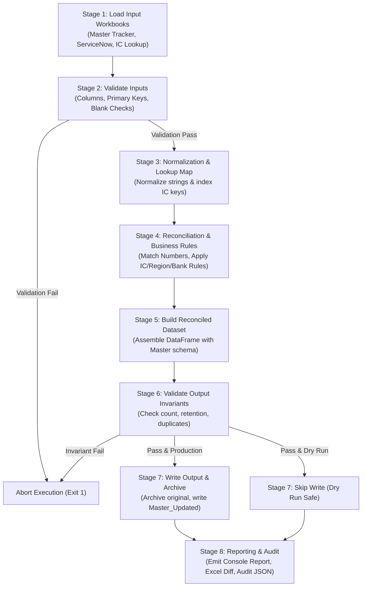

# FCB Monthly Incident Tracker Automation

[](https://www.python.org/)
[](https://openpyxl.readthedocs.io/)
[](#features)
[](#disclaimer--internal-use-policy)

Automated monthly reconciliation and synchronization engine for the **First Citizens Bank (FCB) Incident Tracker** using ServiceNow data exports.

---

## 📋 Table of Contents

- [Purpose & Overview](#purpose--overview)
- [Key Features](#key-features)
- [Architecture & Pipeline](#architecture--pipeline)
- [Quick Start](#quick-start)
- [Project Structure](#project-structure)
- [Configuration Overview](#configuration-overview)
- [Documentation Index](#documentation-index)
- [Test Data Policy](#test-data-policy)
- [Disclaimer & Internal Use Policy](#disclaimer--internal-use-policy)

---

## Purpose & Overview

The **FCB Monthly Incident Tracker Automation** system eliminates error-prone manual copy-pasting between ServiceNow monthly incident reports and the enterprise Master Incident Tracker. Built with Python, [`openpyxl`](https://openpyxl.readthedocs.io/), and [`pandas`](https://pandas.pydata.org/), this utility automates monthly data intake, field mapping, business rule evaluation, and reconciliation while preserving historical records, custom formatting, and embedded Excel formulas.

> [!NOTE]
> The automation runs in **dry-run mode by default** to safeguard corporate master trackers against accidental modifications. Production writes occur only when explicitly invoked with the `--production` flag.

---

## Key Features

- **Number-Based Deterministic Reconciliation**: Uses ServiceNow incident `Number` as the immutable primary key to accurately match records between ServiceNow and the Master Tracker.
- **Guaranteed Historical Retention**: Invariant enforcement guarantees that historical master incidents not present in the latest ServiceNow extract are retained without data loss.
- **Non-Blank Overwrite Protection**: Protects manually enriched master tracker fields from being overwritten with empty or blank values from ServiceNow.
- **Automated Business Rules Engine**:
  - **IC Determination**: Evaluates a 3-tier decision tree (`IC` -> `Priority = 3` with `Proposed By` -> Blank).
  - **Region Mapping**: Dynamic lookup against an IC-to-Region reference table with case-insensitive handling and whitespace normalization.
  - **Bank / SVB Flagging**: Evaluates assignment groups for SVB affiliations (e.g., matching `"SVB"` in `Assignment group`).
- **Excel Formula & Structure Preservation**: Uses [`openpyxl`](file:///c:/Users/Ansh%20Singh/OneDrive/Desktop/Automation/FCB_Incident_Tracker_Automation/src/output_writer.py) to read cell metadata, maintaining calculated columns (such as `Resolution Time`), worksheet structures, and formatting across runs.
- **Multi-Stage Validation Gateways**: Pre-execution input validation, lookup validation, and post-execution output invariant checks halt execution if anomalies or duplicate keys are detected.
- **Dual Audit & Reconciliation Reporting**:
  - Detailed, machine-readable JSON execution log ([`audit_YYYYMMDD_HHMMSS.json`](file:///c:/Users/Ansh%20Singh/OneDrive/Desktop/Automation/FCB_Incident_Tracker_Automation/src/audit.py)) recording counts, warnings, and file hashes.
  - Tabbed Excel report ([`Reconciliation_Report_YYYYMMDD_HHMMSS.xlsx`](file:///c:/Users/Ansh%20Singh/OneDrive/Desktop/Automation/FCB_Incident_Tracker_Automation/src/output_writer.py#L208-L269)) detailing run metrics, field-level diffs, newly ingested incidents, and IC lookup misses.
- **Automated Pre-Run Archiving**: Generates a timestamped snapshot of the target Master Tracker in the `archive/` directory prior to applying any production updates.

---

## Architecture & Pipeline

The system operates across an 8-stage sequential pipeline designed to guarantee data integrity:



For complete architectural details, see [ARCHITECTURE.md](file:///c:/Users/Ansh%20Singh/OneDrive/Desktop/Automation/FCB_Incident_Tracker_Automation/ARCHITECTURE.md).

---

## Quick Start

Follow these steps to set up the environment, generate synthetic test data, and run a validation dry run.

### 1. Prerequisites

- **Python 3.9+** (Python 3.9, 3.10, 3.11, or 3.12 supported)
- Standard tools: `pip` and PowerShell / Command Prompt / Terminal

### 2. Environment Setup

Clone or extract the repository, navigate to the project root, and install the required dependencies:

```bash
# Navigate to project directory
cd FCB_Incident_Tracker_Automation

# (Recommended) Create and activate a virtual environment
python -m venv .venv
# On Windows PowerShell:
.venv\Scripts\Activate.ps1
# On Windows CMD:
.venv\Scripts\activate.bat
# On macOS/Linux:
source .venv/bin/activate

# Install required Python dependencies
pip install -r requirements.txt
```

### 3. Generate Test Data

Generate synthetic test files designed to test all edge cases (new records, status updates, SVB bank flags, IC fallbacks, formula preservation):

```bash
python test_data/generate_test_data.py
```

*Output files generated in `test_data/`:*
- `master_test.xlsx`
- `servicenow_test.xlsx`
- `ic_lookup_test.xlsx`

### 4. Execute Dry Run

Run the reconciliation pipeline in **dry-run mode** using the default configuration:

```bash
python -m src.main --dry-run
```

You can also run without arguments as dry-run is the default configuration:

```bash
python -m src.main
```

### 5. Inspect Results

Review the generated console output and check the `output/` directory for:
- `Reconciliation_Report_<TIMESTAMP>.xlsx`: Multi-tab reconciliation workbook.
- `audit_<TIMESTAMP>.json`: Complete execution and audit metadata.

### 6. Run Test Suite

Run unit and integration tests to verify pipeline behavior:

```bash
pytest
```

---

## Project Structure

```text
FCB_Incident_Tracker_Automation/
├── .gitignore                      # Git exclusion rules
├── requirements.txt                # Python package dependencies
├── README.md                       # Project overview and quick start (this file)
├── USER_GUIDE.md                   # Monthly operational user manual
├── CORPORATE_SETUP.md              # Enterprise deployment & integration guide
├── TROUBLESHOOTING.md              # Incident error guide & resolution steps
├── config/
│   └── config.json                 # Pipeline settings, mappings, and validation rules
├── src/
│   ├── __init__.py                 # Package marker
│   ├── main.py                     # CLI entry point and pipeline orchestrator
│   ├── config_loader.py            # Config loader and schema validator
│   ├── data_loader.py              # Excel workbook ingest and formula detector
│   ├── validator.py                # Pre/post execution data integrity validators
│   ├── normalizer.py               # Whitespace normalization and string comparison
│   ├── business_rules.py           # IC, Region, Bank, and Priority business rules
│   ├── reconciler.py               # Core Number-based matching and reconciliation
│   ├── output_writer.py            # openpyxl workbook writer & archive manager
│   ├── report_generator.py         # Summary metrics and console formatting
│   └── audit.py                    # JSON audit trail generator
├── test_data/
│   ├── README.md                   # Test data disclaimer and description
│   ├── generate_test_data.py       # Test data generation script
│   ├── master_test.xlsx            # Baseline synthetic Master Tracker
│   ├── servicenow_test.xlsx        # Synthetic ServiceNow monthly extract
│   └── ic_lookup_test.xlsx         # Synthetic IC-to-Region reference lookup
├── tests/
│   ├── __init__.py                 # Test package marker
│   ├── conftest.py                 # Pytest fixtures and mock datasets
│   ├── test_business_rules.py      # Business rule unit tests
│   ├── test_normalizer.py          # Normalizer unit tests
│   ├── test_reconciler.py          # Reconciler unit tests
│   ├── test_validator.py           # Validator unit tests
│   └── test_integration.py        # End-to-end pipeline integration tests
├── output/                         # Generated reports, updated workbooks, audit logs
└── archive/                        # Pre-run timestamped backup snapshots
```

---

## Configuration Overview

All operational settings are centralized in [`config/config.json`](file:///c:/Users/Ansh%20Singh/OneDrive/Desktop/Automation/FCB_Incident_Tracker_Automation/config/config.json):

| Section | Description | Key Parameters |
| :--- | :--- | :--- |
| `mode` & `dry_run` | Execution governance | `"mode": "development"` / `"production"`, `"dry_run": true` |
| `paths` | Input and output locations | `master_tracker`, `servicenow_input`, `ic_lookup`, `output_directory`, `archive_directory` |
| `sheets` | Excel worksheet names | `master_sheet` (`"FCB"`), `servicenow_sheet`, `ic_lookup_sheet` |
| `tables` | Optional Excel table names | `master_table`, `servicenow_table`, `ic_lookup_table` (set to `null` if using sheet ranges) |
| `field_mapping` | ServiceNow to Master mappings | Maps source column -> target column, `is_key`, `overwrite_if_blank` |
| `unmapped_fields` | Unconfirmed fields | `Created`, `Vendor Caused?` *(⚠️ REQUIRES CORPORATE VALIDATION)* |
| `business_rules` | Deterministic logic | Parameters for IC determination, Region lookup, SVB bank flag |
| `formula_columns`| Preserved formula headers | `known_formulas`, `preserve_all_detected: true` |
| `validation` | Strict schema rules | `required_servicenow_columns`, `required_master_columns`, duplicate/blank blocking |

> [!IMPORTANT]
> When switching from test mode to production, update the paths in `config/config.json` to point to corporate network locations or local OneDrive synchronization folders. Refer to [CORPORATE_SETUP.md](file:///c:/Users/Ansh%20Singh/OneDrive/Desktop/Automation/FCB_Incident_Tracker_Automation/CORPORATE_SETUP.md) for full deployment instructions.

---

## Documentation Index

| Document | Audience | Description |
| :--- | :--- | :--- |
| [USER_GUIDE.md](file:///c:/Users/Ansh%20Singh/OneDrive/Desktop/Automation/FCB_Incident_Tracker_Automation/USER_GUIDE.md) | Business Analysts, Operators | Step-by-step monthly operational walkthrough, output interpretation, report reading. |
| [CORPORATE_SETUP.md](file:///c:/Users/Ansh%20Singh/OneDrive/Desktop/Automation/FCB_Incident_Tracker_Automation/CORPORATE_SETUP.md) | System Administrators, IT Leads | Production deployment guide, network/SharePoint drive configuration, scheduling, corporate field validations. |
| [TROUBLESHOOTING.md](file:///c:/Users/Ansh%20Singh/OneDrive/Desktop/Automation/FCB_Incident_Tracker_Automation/TROUBLESHOOTING.md) | All Users & Support Staff | Diagnostic procedures, common error resolutions (missing columns, lock errors, duplicate keys). |
| [ARCHITECTURE.md](file:///c:/Users/Ansh%20Singh/OneDrive/Desktop/Automation/FCB_Incident_Tracker_Automation/ARCHITECTURE.md) | Engineers, Technical Leads | Pipeline architecture, state transitions, data structures, formula retention mechanics. |
| [BUSINESS_RULES.md](file:///c:/Users/Ansh%20Singh/OneDrive/Desktop/Automation/FCB_Incident_Tracker_Automation/BUSINESS_RULES.md) | Product Owners, Auditors | Comprehensive formal specifications for IC determination, Region assignment, and SVB logic. |
| [FIELD_MAPPING.md](file:///c:/Users/Ansh%20Singh/OneDrive/Desktop/Automation/FCB_Incident_Tracker_Automation/FIELD_MAPPING.md) | Analysts, Data Engineers | Detailed field mapping matrix between ServiceNow and Master Tracker schemas. |
| [SECURITY.md](file:///c:/Users/Ansh%20Singh/OneDrive/Desktop/Automation/FCB_Incident_Tracker_Automation/SECURITY.md) | InfoSec, Compliance Officers | Data privacy controls, zero-cloud execution model, credential management. |
| [ASSUMPTIONS.md](file:///c:/Users/Ansh%20Singh/OneDrive/Desktop/Automation/FCB_Incident_Tracker_Automation/ASSUMPTIONS.md) | Project Stakeholders | Documented operational assumptions, corporate validation items, constraints. |

---

## Test Data Policy

> [!WARNING]
> **SYNTHETIC TEST DATA NOTICE**: All files located within the `test_data/` directory (`master_test.xlsx`, `servicenow_test.xlsx`, `ic_lookup_test.xlsx`) contain **100% synthetic, fictitious data**. No real employee names, customer records, corporate credentials, or confidential FCB incident details are present.

Corporate production runs must point to authorized enterprise data repositories as specified in [`CORPORATE_SETUP.md`](file:///c:/Users/Ansh%20Singh/OneDrive/Desktop/Automation/FCB_Incident_Tracker_Automation/CORPORATE_SETUP.md).

---

## Disclaimer & Internal Use Policy

This software is developed strictly for internal use supporting First Citizens Bank (FCB) incident management operations. Unauthorized distribution, copying, or public dissemination of this codebase or its associated configuration is strictly prohibited. All corporate incident data processed by this tool must adhere to enterprise data privacy and information security policies.
