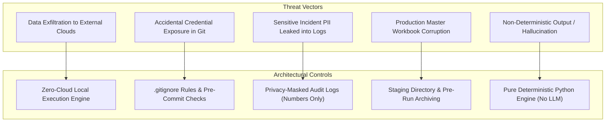

# FCB Monthly Incident Tracker Automation — Security & Compliance Architecture

## 1. Information Security & Compliance Governance

This document establishes the security, privacy, and compliance principles governing the design, implementation, and deployment of the **FCB Monthly Incident Tracker Automation** system.

As a critical operational tool managing technology incidents across banking systems (including First Citizens Bank and Silicon Valley Bank environments), the application must adhere to rigorous corporate information security standards, Gramm-Leach-Bliley Act (GLBA) requirements, Sarbanes-Oxley (SOX) controls, and the principle of least privilege.

---

## 2. Data Classification & Protection

### 2.1 Information Classification
All data ingested from ServiceNow exports and the Master Incident Tracker is classified as **Confidential Corporate Information / Restricted Banking Data**.

Incident records regularly contain:
- Internal system topologies, infrastructure hostnames, and application architecture details.
- Root cause descriptions outlining operational vulnerabilities and security incidents.
- Names, employee IDs, and email addresses of internal staff and third-party vendors.
- Business impact analyses concerning banking, payment, and lending platforms.

### 2.2 Security Controls Summary

| Security Domain | Implemented Control | Standard / Policy Reference |
| :--- | :--- | :--- |
| **Data Ingestion** | Local filesystem access only; no cloud egress | Corporate Air-Gap / Network Security |
| **Credential Storage** | Zero credentials or tokens in code, configs, or tests | Zero-Trust / Secret Management Policy |
| **Version Control** | Complete exclusion of incident data and production configs | Corporate Source Code Security Standard |
| **Audit Logging** | Ticket Numbers only (`INC*`); no descriptions or PII | Enterprise Privacy & Data Governance |
| **Integrity Assurance** | Staging write architecture; pre-execution automated archiving | Operational Resilience & BC/DR |
| **Execution Model** | 100% Deterministic Python; no generative AI/LLM components | Model Risk Management & Auditability |

---

## 3. Threat Model & Risk Mitigation



---

## 4. Architectural Security Principles

### 4.1 Local Processing Only (Zero Cloud Footprint)
The automation engine executes entirely within the local execution environment (or authorized corporate on-premises server):
- **No Cloud API Dependencies:** The application does not communicate with external cloud services, third-party analytics, or telemetry platforms.
- **No Outbound Network Sockets:** Network egress is disabled by design. The engine requires no internet connection to parse, reconcile, and produce output workbooks.
- **Air-Gap Compatibility:** Can be safely executed in restricted corporate environments, DMZs, or isolated virtual desktops (VDI).

### 4.2 Credential & Secret Management
The application strictly enforces a **Zero-Secret Architecture**:
- **No Embedded Credentials:** No usernames, passwords, API tokens, bearer keys, or connection strings are stored in source code, configuration files, or environment scripts.
- **File-Based Ingestion:** Because ServiceNow data is ingested via an analyst-downloaded Excel workbook, programmatic API credentials for ServiceNow are completely unnecessary.
- **No Stored SharePoint Passwords:** If input files are synchronized from Microsoft SharePoint Online or OneDrive, authentication is handled natively by the corporate operating system (Windows Integrated Authentication / Single Sign-On via Kerberos or Azure AD / Entra ID with Multi-Factor Authentication). The script interacts solely with local filesystem synchronization paths.

### 4.3 Version Control Hygiene & Git Safeguards
Live corporate data must never enter Git repositories. The project repository enforces strict `.gitignore` rules:

```gitignore
# Output and archive (generated at runtime - contain corporate data)
output/
archive/

# Python virtual environment & bytecode
__pycache__/
*.py[cod]
.venv/
venv/

# Corporate configuration and secret patterns
*.credentials
*.secret
*.token
corporate_config.json

# Test output artifacts
test_output/
```

- **Synthetic Test Data Only:** The `tests/` directory and `test_data/` fixtures utilize strictly synthetic, fabricated incident records designed specifically to test edge cases without exposing real enterprise data.
- **Corporate Config Separation:** A sample configuration (`config/config.json`) with generic placeholder paths is provided. Any custom configuration containing internal hostnames or file paths (`corporate_config.json`) is gitignored by default.

### 4.4 Data Privacy in Logging & Audit Trails
Operational visibility must not compromise data privacy. The logging engine (`src/audit.py`) adheres to strict data minimization principles:

- **Incident Number Only:** Audit logs (`output/audit_*.json`) and execution traces record only the unique incident identifier (e.g., `"INC0012345"`).
- **Redaction of Sensitive Text:** Short descriptions, technical work notes, configuration items, and assignee names are **explicitly excluded** from log files.
- **Audit File Schema Example:**
  ```json
  {
    "timestamp": "2026-09-12T14:30:00.123456",
    "mode": "production",
    "dry_run": false,
    "source_files": {
      "master_tracker": "FCB_Master_YTD.xlsx",
      "servicenow_input": "SN_Monthly_Export.xlsx",
      "ic_lookup": "IC_Lookup.xlsx"
    },
    "record_counts": {
      "master_before": 1420,
      "servicenow_input": 315,
      "updated": 210,
      "new": 45,
      "historical_retained": 1210,
      "total_output": 1465
    },
    "validation_passed": true,
    "output_file": "Master_Updated_20260912_143000.xlsx",
    "archive_file": "FCB_Master_YTD_before_20260912_143000.xlsx",
    "error_count": 0,
    "warning_count": 2,
    "status": "SUCCESS"
  }
  ```

---

## 5. Operational Integrity & Safe Staging

To eliminate the risk of production master file destruction, the system implements a multi-tier staging and safety protocol:

```mermaid
sequenceDiagram
    autonumber
    actor Analyst as Operational Analyst
    participant CLI as Automation CLI
    participant FS as Local Filesystem
    participant Val as Validation Engine
    participant Arch as Archive Store
    participant Out as Output Staging

    Analyst->>CLI: Execute python -m src.main --production
    CLI->>FS: Load Master, ServiceNow, and Reference Tables
    CLI->>Val: Run Input Validations (Stage 2)
    alt Validation Failure
        Val-->>CLI: Blocking Errors Detected
        CLI-->>Analyst: Abort execution (Code 1); No files modified
    else Validation Success
        Val-->>CLI: Pass
        CLI->>CLI: Execute Reconciliation & Business Rules (Stages 4-5)
        CLI->>Val: Run Output Invariant Checks (Stage 6)
        alt Invariants Violated (Historical Data Loss Detected)
            Val-->>CLI: Invariant Failure
            CLI-->>Analyst: Abort execution (Code 1); Staging aborted
        else Invariants Verified
            CLI->>Arch: Copy original Master -> archive/Master_before_TIMESTAMP.xlsx
            CLI->>Out: Write reconciled output -> output/Master_Updated_TIMESTAMP.xlsx
            CLI->>Out: Write reconciliation report & audit log
            CLI-->>Analyst: Exit 0 (Success); Ready for promotion
        end
    end
```

1. **Zero In-Place Overwrites:** The system never writes directly to the source master file. Reconciled data is staged in the `output/` directory with a timestamped filename.
2. **Automated Master Snapshotting:** Prior to writing any output, the source master file is replicated into an isolated `archive/` directory (`<file>_before_YYYYMMDD_HHMMSS.xlsx`).
3. **Fail-Closed Gatekeeper:** If output validation detects any discrepancy—such as a missing historical record or duplicate ticket ID—the pipeline terminates immediately, discarding intermediate memory objects and leaving all filesystem assets untouched.
4. **Dry-Run Default:** In development environments, the application defaults to `--dry-run`, requiring explicit `--production` flags to write files to disk.

---

## 6. Deterministic Processing vs. AI / LLM Risks

Enterprise financial applications are subject to strict algorithmic governance under Model Risk Management standards. 

- **No Generative AI or LLMs in Pipeline Logic:** The reconciliation engine, business rule evaluator, and output generator rely exclusively on standard, deterministic Python code and explicit conditional logic.
- **Zero Hallucination Risk:** Records are matched strictly on exact, normalized incident numbers. Field values are populated either directly from ServiceNow or via deterministic decision trees and dictionary lookups.
- **Reproducibility:** Given identical input files, the system will produce 100% identical outputs and audit records on every run.
