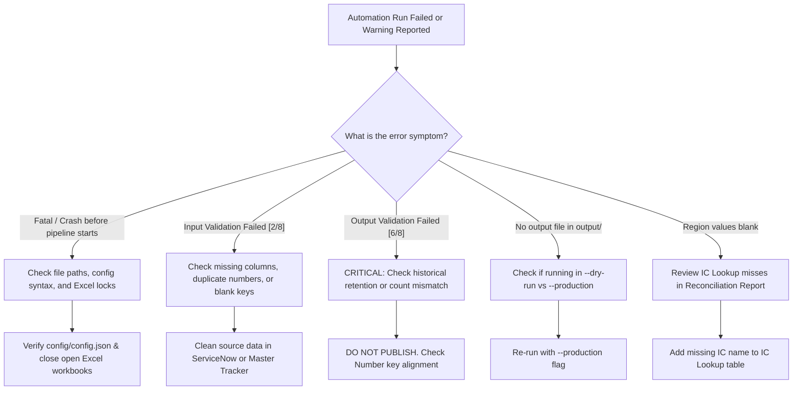

# FCB Monthly Incident Tracker — Troubleshooting & Diagnostic Guide

A practical troubleshooting manual for operators, analysts, and administrators resolving issues in the **FCB Monthly Incident Tracker Automation** pipeline.

---

## 📋 Table of Contents

- [1. Diagnostic Decision Tree](#1-diagnostic-decision-tree)
- [2. Quick Reference Error Matrix](#2-quick-reference-error-matrix)
- [3. Critical Invariant & Validation Errors](#3-critical-invariant--validation-errors)
  - [CRITICAL: Historical Data Loss Detected](#critical-historical-data-loss-detected)
  - [ERROR: Duplicate Numbers in Source Data or Output](#error-duplicate-numbers-in-source-data-or-output)
  - [ERROR: Blank Numbers in Incident Key Column](#error-blank-numbers-in-incident-key-column)
  - [ERROR: Missing Required Column](#error-missing-required-column)
- [4. File System & Configuration Errors](#4-file-system--configuration-errors)
  - [ERROR: Configuration File Not Found](#error-configuration-file-not-found)
  - [ERROR: Input File Not Found](#error-input-file-not-found)
  - [ERROR: Sheet Not Found in Workbook](#error-sheet-not-found-in-workbook)
  - [ERROR: Permission Denied / File In Use (Lock)](#error-permission-denied--file-in-use-lock)
- [5. Environment & Terminal Errors](#5-environment--terminal-errors)
  - [ERROR: UnicodeEncodeError / UnicodeDecodeError on Windows](#error-unicodeencodeerror--unicodedecodeerror-on-windows)
  - [BEHAVIOR: Output File Not Written (Pipeline Passed)](#behavior-output-file-not-written-pipeline-passed)
- [6. System Warnings & Informational Alerts](#6-system-warnings--informational-alerts)
  - [WARNING: IC Lookup Miss (Blank Region Generated)](#warning-ic-lookup-miss-blank-region-generated)
  - [WARNING: Additional Columns Detected](#warning-additional-columns-detected)
- [7. Emergency Recovery Protocol](#7-emergency-recovery-protocol)

---

## 1. Diagnostic Decision Tree



---

## 2. Quick Reference Error Matrix

| Symptom / Log Message | Severity | Likely Root Cause | Quick Fix |
| :--- | :---: | :--- | :--- |
| `HISTORICAL DATA LOSS: X master record(s) missing` | 🚨 **CRITICAL** | A historical incident number was removed or altered | **DO NOT PUBLISH.** Check Master file key column integrity. |
| `Missing required column: '<Column>'` | ❌ High | ServiceNow export view or Master Tracker header changed | Align header names in Excel or update `config.json`. |
| `Duplicate Number(s) detected: [...]` | ❌ High | Duplicate incident numbers in ServiceNow or Master | Clean duplicate rows in source file. |
| `blank Number(s) detected` | ❌ High | Trailing blank rows or missing key values in input sheet | Delete empty bottom rows in Excel. |
| `Configuration file not found` | ❌ High | Invalid path supplied to `--config` | Check relative or absolute config path. |
| `File not found: <path>` | ❌ High | Incorrect file path or disconnected network share | Verify `paths` in `config.json` and share access. |
| `Sheet '<name>' not found in '<file>'` | ❌ High | Excel tab renamed | Update `sheets` in `config.json` to match exact tab name. |
| `PermissionError: [Errno 13]` | ❌ High | Excel workbook is open in Microsoft Excel desktop | Close Excel and re-run. |
| `UnicodeEncodeError: 'charmap' codec...` | ⚠️ Medium | Windows console code page mismatch | Run `set PYTHONIOENCODING=utf-8` before execution. |
| Output workbook not written | ℹ️ Low | Pipeline executed in Dry Run mode (default) | Run with `--production` flag to generate outputs. |
| `IC lookup misses: X` | ⚠️ Low | Incident Coordinator name not in lookup table | Add new IC and Region to `IC Lookup` sheet. |
| `Additional columns detected` | ℹ️ Low | New extra columns present in ServiceNow export | Informational only. No action needed unless mapping required. |

---

## 3. Critical Invariant & Validation Errors

### CRITICAL: Historical Data Loss Detected

#### Symptom:
```text
[6/8] Validating output...
Validation: FAILED
  Errors: 1
  --- Errors ---
    ✗ [Output] HISTORICAL DATA LOSS: 2 master record(s) missing from output: ['INC0010012', 'INC0010015']
✗ OUTPUT VALIDATION FAILED — output will not be written.
```

#### Explanation:
The automation enforces an immutable business invariant: **Every historical record present in the Master Tracker must exist in the reconciled output.** If any historical incident disappears, the system halts immediately and blocks writing output.

#### Resolution Steps:
1. **DO NOT PUBLISH OR OVERWRITE ANY FILES.**
2. Inspect the Master Tracker sheet to verify whether someone accidentally deleted rows, sorted incorrectly, or edited the `Number` column.
3. If an incident number was typoed or altered (e.g., `INC0010012` became `INC0010012-rev`), restore the original number.
4. If the active Master Tracker has corrupted rows, restore the previous clean snapshot from the `archive/` folder.
5. Re-run `python -m src.main --dry-run` to confirm the retention invariant passes.

---

### ERROR: Duplicate Numbers in Source Data or Output

#### Symptom:
```text
[2/8] Validating input data...
Validation: FAILED
  Errors: 1
  --- Errors ---
    ✗ [ServiceNow] 2 duplicate Number(s) detected: ['INC0045100']
✗ INPUT VALIDATION FAILED — aborting pipeline.
```

#### Explanation:
The incident `Number` is the unique matching key. Duplicate numbers in either the ServiceNow export or the Master Tracker cause ambiguous matching and corrupt reconciliation results.

#### Resolution Steps:
1. Open the identified source workbook (ServiceNow export or Master Tracker).
2. Use Excel's **Conditional Formatting > Highlight Cells Rules > Duplicate Values** on the `Number` column.

> 📷 **[Screenshot Placeholder: Microsoft Excel — Conditional Formatting > Highlight Cells Rules > Duplicate Values on Column A]**

3. Investigate why duplicates exist:
   - **ServiceNow Export**: The export may contain multiple task/SLA rows per incident. Adjust the ServiceNow export filter or de-duplicate by keeping the latest updated row.
   - **Master Tracker**: Remove or resolve duplicate historical entries.
4. Save the file and re-run `--dry-run`.

---

### ERROR: Blank Numbers in Incident Key Column

#### Symptom:
```text
[2/8] Validating input data...
Validation: FAILED
  Errors: 1
  --- Errors ---
    ✗ [Master Tracker] 1 blank Number(s) detected.
```

#### Explanation:
Often, users format empty rows below the active table with borders, formulas, or spaces. Pandas reads these as blank rows with `NaN` for `Number`.

#### Resolution Steps:
1. Open the indicated Excel file.
2. Scroll to the bottom of the table.
3. Select the rows beneath the last actual incident, right-click, and select **Delete** (do not just press Backspace/Delete key, use full row deletion).
4. Save the file (`Ctrl + S`) and re-run.

---

### ERROR: Missing Required Column

#### Symptom:
```text
[2/8] Validating input data...
Validation: FAILED
  Errors: 1
  --- Errors ---
    ✗ [ServiceNow] Missing required column: 'Actual Incident Resolve'
```

#### Explanation:
The source sheet is missing a mandatory column defined in `config.json` under `validation.required_servicenow_columns` or `validation.required_master_columns`.

#### Resolution Steps:
1. Open the source Excel file and check row 1 headers.
2. Look for minor spelling discrepancies, trailing spaces, or renamed headers (e.g., `"Resolved Date"` vs `"Actual Incident Resolve"`).
3. If ServiceNow changed its export column name:
   - Update `config/config.json`:
     - Under `field_mapping`: update `"source_column": "<New Name>"`.
     - Under `validation.required_servicenow_columns`: update the column name.
4. Re-run `--dry-run`.

---

## 4. File System & Configuration Errors

### ERROR: Configuration File Not Found

#### Symptom:
```text
✗ CONFIGURATION ERROR: Configuration file not found: C:\Automation\config\config_custom.json
```

#### Resolution Steps:
1. Confirm the configuration file path:
   ```powershell
   # Default path:
   python -m src.main
   
   # Explicit path:
   python -m src.main --config config/config.json
   ```
2. Verify that `config/config.json` exists in the repository root.

---

### ERROR: Input File Not Found

#### Symptom:
```text
[1/8] Loading input files...
  ✗ FATAL: Cannot load Master Tracker: File not found: data/FCB_Master.xlsx
```

#### Resolution Steps:
1. Open [`config/config.json`](file:///c:/Users/Ansh%20Singh/OneDrive/Desktop/Automation/FCB_Incident_Tracker_Automation/config/config.json) and inspect the `paths` section.
2. Confirm that the path is relative to the project root or a valid UNC network path.
3. If using network shares (e.g., `Z:\`), verify the network drive is connected and authenticated.
4. Ensure the file extension (`.xlsx`) is included.

---

### ERROR: Sheet Not Found in Workbook

#### Symptom:
```text
[1/8] Loading input files...
  ✗ FATAL: Cannot load Master Tracker: Sheet 'FCB_Tracker' not found in 'data/FCB_Master.xlsx'. Available sheets: ['FCB', 'Summary', 'Pivot']
```

#### Resolution Steps:
1. Check the `sheets` block in `config/config.json`:
   ```json
   {
     "sheets": {
       "master_sheet": "FCB"
     }
   }
   ```
2. Update the sheet name to match one of the available sheets listed in the error message.

---

### ERROR: Permission Denied / File In Use (Lock)

#### Symptom:
```text
PermissionError: [Errno 13] Permission denied: 'C:\Share\FCB_Master.xlsx'
```

#### Explanation:
Excel locks files exclusively when opened by an analyst. The Python engine cannot read or write to locked files.

#### Resolution Steps:
1. Ask team members to save and close the workbook in Microsoft Excel.
2. If the lock persists, close any hidden Excel processes via Task Manager:
   - Open Task Manager (`Ctrl + Shift + Esc`) > End task on **Microsoft Excel**.
3. In corporate SharePoint/OneDrive environments, verify that co-authoring sync is complete.

---

## 5. Environment & Terminal Errors

### ERROR: UnicodeEncodeError / UnicodeDecodeError on Windows

#### Symptom:
```text
UnicodeEncodeError: 'charmap' codec can't encode character '\u2713' in position ...
```

#### Explanation:
The Windows legacy command prompt (Command Prompt / PowerShell) sometimes uses default OEM code pages (e.g., CP437 or CP1252) that cannot print Unicode symbols (like `✓` or `⚠`).

#### Resolution Steps:
Set the Python I/O encoding environment variable to UTF-8 before executing:

**In PowerShell:**
```powershell
$env:PYTHONIOENCODING = "utf-8"
python -m src.main --dry-run
```

**In Command Prompt (CMD):**
```cmd
set PYTHONIOENCODING=utf-8
python -m src.main --dry-run
```

---

### BEHAVIOR: Output File Not Written (Pipeline Passed)

#### Symptom:
The pipeline reports `PIPELINE COMPLETE — STATUS: PASSED`, but no updated file appears in `output/Master_Updated_*.xlsx`.

#### Explanation:
The system ran in **Dry Run mode**. In dry run mode, Stage 7 prints:
```text
[7/8] DRY RUN — skipping output write.
  (Re-run with --production to write output)
```

#### Resolution Steps:
Execute with the `--production` flag:
```powershell
python -m src.main --production
```

---

## 6. System Warnings & Informational Alerts

### WARNING: IC Lookup Miss (Blank Region Generated)

#### Symptom:
```text
[4/8] Reconciling incidents...
  IC lookup misses: 1
```

#### Explanation:
An incident's `IC` value (or fallback `Proposed By` value) does not match any entry in the IC Lookup reference table. As a result, the incident's `Region` field is set to blank.

#### Resolution Steps:
1. Open `output/Reconciliation_Report_<TIMESTAMP>.xlsx`.
2. Navigate to the **IC Lookup Misses** worksheet.
3. Review the reported IC name (e.g., `"AppDev South"`).
4. Open the IC Lookup workbook (specified in `config.json` under `paths.ic_lookup`).
5. Add a new row mapping the IC name to its proper Region:
   - Column `IC`: `AppDev South`
   - Column `Region`: `Southern`
6. Save the lookup file and re-run `--dry-run`. Confirm `IC lookup misses: 0`.

---

### WARNING: Additional Columns Detected

#### Symptom:
```text
[2/8] Validating input data...
Validation: PASSED
  Warnings: 1
  --- Warnings ---
    ⚠ [ServiceNow] Additional columns detected (not in schema): ['Business Service', 'Work Notes']
```

#### Explanation:
The ServiceNow export includes columns that are not listed in `validation.required_servicenow_columns`.

#### Resolution Steps:
- **No immediate action required**: This warning is informational and detects schema drift. Unmapped additional columns are safely ignored during reconciliation.
- If one of these new columns needs to be captured in the Master Tracker, configure it in `config.json` under `field_mapping`.

---

## 7. Emergency Recovery Protocol

If an erroneous file was promoted or a production run encountered an issue:

1. **Locate Latest Archive**:
   Navigate to the `archive/` folder. Files are named chronologically:
   `archive/<OriginalFileName>_before_YYYYMMDD_HHMMSS.xlsx`
2. **Verify Backup Integrity**:
   Open the archive file and confirm row counts and formulas match expectations.
3. **Restore**:
   Copy the archive file back to the operational Master Tracker path, overwriting the erroneous file.
4. **Audit Review**:
   Examine `output/audit_<TIMESTAMP>.json` to determine the cause of the discrepancy before attempting another run.
