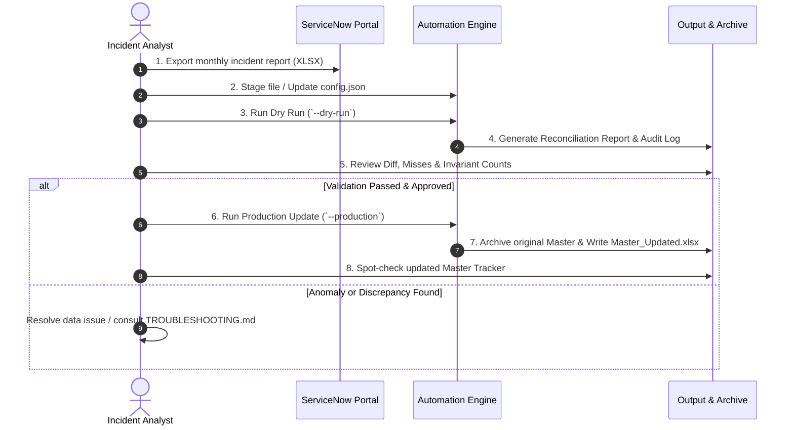

# FCB Monthly Incident Tracker — User Guide

A step-by-step operational guide for incident managers, operational analysts, and team leads responsible for monthly updates to the FCB Incident Tracker.

---

## 📑 Table of Contents

1. [Introduction](#1-introduction)
2. [Monthly Workflow Overview](#2-monthly-workflow-overview)
3. [Step-by-Step Monthly Execution](#3-step-by-step-monthly-execution)
   - [Step 1: Download ServiceNow Incident Report](#step-1-download-servicenow-incident-report)
   - [Step 2: Stage Input File & Update Configuration](#step-2-stage-input-file--update-configuration)
   - [Step 3: Execute Dry Run Validation](#step-3-execute-dry-run-validation)
   - [Step 4: Review the Reconciliation Report](#step-4-review-the-reconciliation-report)
   - [Step 5: Execute Production Update](#step-5-execute-production-update)
   - [Step 6: Validate the Updated Master Tracker](#step-6-validate-the-updated-master-tracker)
   - [Step 7: Automated Backup Verification](#step-7-automated-backup-verification)
4. [Dry Run vs. Production Mode](#4-dry-run-vs-production-mode)
5. [Understanding System Outputs](#5-understanding-system-outputs)
   - [Console Output](#console-output)
   - [Excel Reconciliation Report](#excel-reconciliation-report)
   - [JSON Audit Log](#json-audit-log)
6. [Common Operational Scenarios](#6-common-operational-scenarios)
   - [Scenario A: Initial System Setup / First Run](#scenario-a-initial-system-setup--first-run)
   - [Scenario B: Regular Monthly Ingestion](#scenario-b-regular-monthly-ingestion)
   - [Scenario C: Resolving Unmapped ICs](#scenario-c-resolving-unmapped-ics)
   - [Scenario D: Emergency Recovery from Archive](#scenario-d-emergency-recovery-from-archive)
7. [Operational Best Practices](#7-operational-best-practices)

---

## 1. Introduction

The **FCB Monthly Incident Tracker Automation** automates the reconciliation of monthly incident exports from ServiceNow with the permanent **FCB Master Incident Tracker**.

### What the Tool Does:
- Matches incidents by their unique ServiceNow **`Number`** (e.g., `INC0012345`).
- **Updates** existing incidents in the Master Tracker with the latest ServiceNow status, assignment group, assignee, and resolution date.
- **Appends** newly created incidents to the Master Tracker.
- **Retains** all historical incidents permanently (zero historical data loss).
- **Protects manually populated fields** in the Master Tracker (fields will never be blanked out because ServiceNow has a blank value).
- Automatically applies **IC rules**, **Region lookups**, and **Bank (SVB) categorization**.
- Automatically creates a timestamped backup copy in `archive/` before any production file is touched.

---

## 2. Monthly Workflow Overview

The monthly refresh follows a strict **"Validate First, Update Second"** workflow:



---

## 3. Step-by-Step Monthly Execution

### Step 1: Download ServiceNow Incident Report

1. Log in to your enterprise **ServiceNow** instance.
2. Navigate to **Incident > All** or use the saved monthly filter:
   - Filter criteria: e.g., `Active = true` OR `Resolved >= [Start of Month]` OR `Closed >= [Start of Month]`.
3. Verify that the view contains all required export columns:
   - `Number`, `Short Description`, `Configuration Item`, `Priority`, `State`, `IC`, `Proposed By`, `Assignment Group`, `Assigned To`, `Caused by Change`, `Actual Incident Resolve`.
4. Right-click any column header > **Export** > **Excel (.xlsx)**.

> 📷 **[Screenshot Placeholder: ServiceNow Incident List — Header Right-Click > Export > Excel (.xlsx)]**

5. Save the exported workbook to your workstation.

---

### Step 2: Stage Input File & Update Configuration

1. Copy the downloaded ServiceNow export file into your designated input directory (or shared folder).
2. Open [`config/config.json`](file:///c:/Users/Ansh%20Singh/OneDrive/Desktop/Automation/FCB_Incident_Tracker_Automation/config/config.json) in your preferred text editor (e.g., VS Code, Notepad++).
3. Verify and update the `paths` section to point to your latest files:

```json
{
  "paths": {
    "master_tracker": "data/FCB_Master_Incident_Tracker.xlsx",
    "servicenow_input": "data/ServiceNow_Export_2026_08.xlsx",
    "ic_lookup": "data/IC_Lookup_Table.xlsx",
    "output_directory": "output",
    "archive_directory": "archive"
  }
}
```

> [!TIP]
> Relative paths (relative to the project root) or standard UNC network paths are supported. On Windows, use forward slashes (`/`) or double backslashes (`\\`) in paths.

4. Verify the `sheets` section matches the sheet tab names in your Excel files:

```json
{
  "sheets": {
    "master_sheet": "FCB",
    "servicenow_sheet": "Sheet1",
    "ic_lookup_sheet": "IC Lookup"
  }
}
```

---

### Step 3: Execute Dry Run Validation

Always run a dry run first. A dry run loads the data, executes all business logic and validations, and generates a reconciliation report **without making any changes to the Master Tracker**.

Open PowerShell or Command Prompt, activate your virtual environment, and run:

```powershell
python -m src.main --dry-run
```

You will see console progress indicators like:

```text
============================================================
FCB MONTHLY INCIDENT TRACKER AUTOMATION
Mode: development | Dry Run: True
Timestamp: 2026-09-12T16:30:00.000000
============================================================

[1/8] Loading input files...
  Master Tracker: 10 records loaded
  ServiceNow:     8 records loaded
  IC Lookup:      6 entries loaded

[2/8] Validating input data...
Validation: PASSED
  Errors:   0
  Warnings: 0

[3/8] Building IC lookup map...
  IC Lookup map: 6 entries

[4/8] Reconciling incidents...
  Matched (updated): 6
  New records:       2
  Historical:        4
  Total output:      12
  IC lookup misses:  0

[5/8] Building output dataset...
  Output DataFrame: 12 records, 14 columns

[6/8] Validating output...
Validation: PASSED
  Errors:   0
  Warnings: 0

[7/8] DRY RUN — skipping output write.
  (Re-run with --production to write output)

[8/8] Generating reports and audit trail...
  Reconciliation report: Reconciliation_Report_20260912_163000.xlsx
  Audit log: audit_20260912_163000.json

============================================================
PIPELINE COMPLETE — STATUS: PASSED
============================================================
```

> 📷 **[Screenshot Placeholder: Terminal window displaying successful Dry Run execution with PASSED status]**

---

### Step 4: Review the Reconciliation Report

Navigate to the `output/` directory and open the generated report:  
`output/Reconciliation_Report_YYYYMMDD_HHMMSS.xlsx`.

Inspect the 4 tabs:
1. **Summary**: Total records before, records ingested, count updated, count new, historical retained, SVB count, and validation status.
2. **Changes**: Field-by-field differences for matched incidents (e.g., `State: 'In Progress' -> 'Resolved'`).
3. **New Incidents**: List of new incident numbers added to the tracker.
4. **IC Lookup Misses**: Lists any incident where the determined IC does not exist in the IC Lookup table (causing `Region` to be blank).

> 📷 **[Screenshot Placeholder: Excel Reconciliation Report — Changes tab displaying side-by-side field transitions]**

> [!WARNING]
> If any **IC Lookup Misses** appear, review them with the incident lead. You can update the `IC Lookup` sheet with the missing ICs before running production.

---

### Step 5: Execute Production Update

Once the dry-run results are reviewed and approved, execute the production update:

```powershell
python -m src.main --production
```

During this execution:
1. An automated pre-run archive copy of the Master Tracker is created in `archive/`.
2. The reconciled dataset is written to `output/Master_Updated_YYYYMMDD_HHMMSS.xlsx`.
3. All formulas (e.g., `Resolution Time`) and workbook styling are preserved.
4. The final audit log and reconciliation report are saved in `output/`.

```text
[7/8] Writing output...
  Archive created: master_test_before_20260912_163500.xlsx
  Output written: Master_Updated_20260912_163500.xlsx
```

---

### Step 6: Validate the Updated Master Tracker

Open `output/Master_Updated_YYYYMMDD_HHMMSS.xlsx` in Excel:
1. **Row Count Verification**: Ensure total rows equal the count from the Reconciliation Summary.
2. **Spot Check**:
   - Check at least two known updated incidents to confirm `State` and `Resolved` dates updated.
   - Check newly appended incidents at the bottom of the table.
   - Check that historical incidents are untouched.
   - Verify formula columns (e.g., `Resolution Time`) are calculating properly.
3. Once satisfied, promote or replace the operational Master Tracker file per your corporate distribution procedure.

---

### Step 7: Automated Backup Verification

Check the `archive/` folder to confirm your pre-execution backup exists:
- Format: `<MasterFileName>_before_YYYYMMDD_HHMMSS.xlsx`

> 📷 **[Screenshot Placeholder: File Explorer displaying timestamped backup in archive/ folder]**

---

## 4. Dry Run vs. Production Mode

| Capability | Dry Run Mode (`--dry-run`) | Production Mode (`--production`) |
| :--- | :--- | :--- |
| **Command** | `python -m src.main --dry-run` | `python -m src.main --production` |
| **Reads Input Files** | Yes | Yes |
| **Applies Validations** | Yes (Full check) | Yes (Full check) |
| **Computes Business Rules** | Yes | Yes |
| **Creates Backup Archive** | No | **Yes** (in `archive/`) |
| **Writes Updated Master File** | **No** (Skipped safely) | **Yes** (in `output/`) |
| **Generates Excel Reconciliation Report** | Yes | Yes |
| **Generates JSON Audit Log** | Yes | Yes |
| **Safe to run at any time?** | **100% Safe (Read-only)** | Writes new files to `output/` |

---

## 5. Understanding System Outputs

### Console Output

The console report provides an immediate summary of the reconciliation run:

```text
FCB INCIDENT TRACKER — RECONCILIATION REPORT
--------------------------------------------------
RUN SUMMARY
  Run Timestamp                           : 2026-09-12T16:35:00
  Master Records Before                   : 10
  ServiceNow Input Records                : 8
  Matched (Updated)                       : 6
  New Records Added                       : 2
  Historical Retained                     : 4
  Total Output Records                    : 12
  IC Lookup Misses                        : 0
  Bank = SVB Count                        : 3
  Blank Region Count (new/updated)        : 0
  Input Validation Errors                 : 0
  Output Validation Errors                : 0
  Status                                  : PASSED
```

### Excel Reconciliation Report

The report file `output/Reconciliation_Report_<TIMESTAMP>.xlsx` contains the following worksheets:

| Sheet | Purpose | Key Columns |
| :--- | :--- | :--- |
| **Summary** | High-level metrics and pass/fail indicators | Parameter, Metric Value |
| **Changes** | Itemized changes made to existing records | Incident Number, Field Changes (`Field: 'Old' -> 'New'`) |
| **New Incidents** | Incidents introduced in this run | Incident Number |
| **IC Lookup Misses** | Incidents where IC could not be resolved to a Region | Missing IC Details |

### JSON Audit Log

The file `output/audit_<TIMESTAMP>.json` provides a tamper-evident, structured audit record:

```json
{
  "timestamp": "2026-09-12T16:35:00.123456",
  "mode": "production",
  "dry_run": false,
  "source_files": {
    "master_tracker": "master_test.xlsx",
    "servicenow_input": "servicenow_test.xlsx",
    "ic_lookup": "ic_lookup_test.xlsx"
  },
  "record_counts": {
    "master_before": 10,
    "servicenow_input": 8,
    "updated": 6,
    "new": 2,
    "historical_retained": 4,
    "total_output": 12
  },
  "validation_passed": true,
  "output_file": "Master_Updated_20260912_163500.xlsx",
  "archive_file": "master_test_before_20260912_163500.xlsx",
  "error_count": 0,
  "warning_count": 0,
  "status": "SUCCESS"
}
```

> [!NOTE]
> Audit logs store **incident numbers and metadata only**. Sensitive ticket descriptions and customer-identifiable text are excluded from audit files.

---

## 6. Common Operational Scenarios

### Scenario A: Initial System Setup / First Run

When onboarding a new team or setting up a fresh environment:
1. Ensure Python 3.9+ and dependencies are installed (`pip install -r requirements.txt`).
2. Run the synthetic test data generator: `python test_data/generate_test_data.py`.
3. Run `python -m src.main --dry-run` to confirm end-to-end execution.
4. Verify tests pass: `pytest`.

### Scenario B: Regular Monthly Ingestion

This is the standard monthly operational process:
1. Download current monthly ServiceNow export.
2. Update `config/config.json` with the new ServiceNow export filename.
3. Run `python -m src.main --dry-run`.
4. Inspect `Reconciliation_Report_*.xlsx` for unexpected field overwrites or missing ICs.
5. Run `python -m src.main --production`.
6. Promote `output/Master_Updated_*.xlsx` to your team's live repository.

### Scenario C: Resolving Unmapped ICs

If the Reconciliation Report shows `IC Lookup Misses`:
1. Open the sheet `IC Lookup Misses` in `output/Reconciliation_Report_*.xlsx`.
2. Identify the unmapped IC strings (e.g., `"Cloud Engineering East"`).
3. Open your reference IC Lookup workbook (defined in `config.json` under `paths.ic_lookup`).
4. Add a new row:
   - `IC`: `Cloud Engineering East`
   - `Region`: `Eastern`
5. Save the lookup workbook and re-run `--dry-run`. Confirm 0 misses.

### Scenario D: Emergency Recovery from Archive

If an invalid master file was inadvertently created or distributed:
1. Open the `archive/` folder.
2. Locate the backup file with the timestamp immediately preceding the run:
   - e.g., `FCB_Master_Incident_Tracker_before_20260912_163500.xlsx`
3. Restore this file as your active Master Tracker.
4. Check the corresponding `output/audit_<TIMESTAMP>.json` to diagnose what went wrong.

---

## 7. Operational Best Practices

> [!TIP]
> - **Close Excel Before Running**: Always close the Master Tracker and ServiceNow Excel files in Microsoft Excel before running the pipeline to avoid `PermissionError` (Excel locks open files).
> - **Never Edit Archive Files**: Files in `archive/` are read-only snapshots.
> - **Spot Check 5 Random Incidents**: After every production run, compare 5 random rows in the output against ServiceNow to build organizational trust in automated results.
